# GACT — Generic Agentic-Coder TUI

A terminal frontend for any agentic-coder backend that conforms to the **GACT v0.1** REST + SSE contract. Two pieces:

- [`emulator/`](./emulator) — a fully-implemented backend that synthesizes realistic agent turns. Boots in ~50ms, no external dependencies.
- [`tui/`](./tui) — a Bubbletea client that drives any GACT-compliant backend (the emulator, or your own).

The contract itself is in [`contract/SPEC.md`](./contract/SPEC.md).

## What it looks like

| | |
|---|---|
| 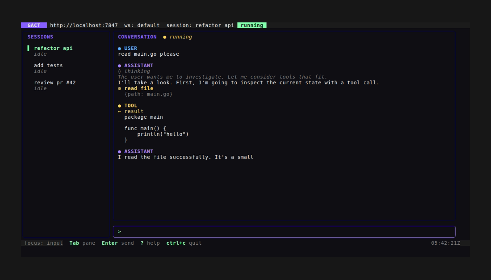 | 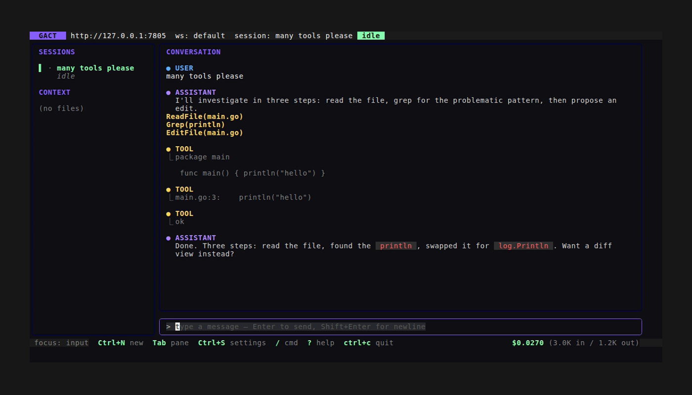 |
| Mid-stream — running badge, thinking + tool call | Claude-Code-style `ToolName(arg)` headers + `⎿` continuation |
| 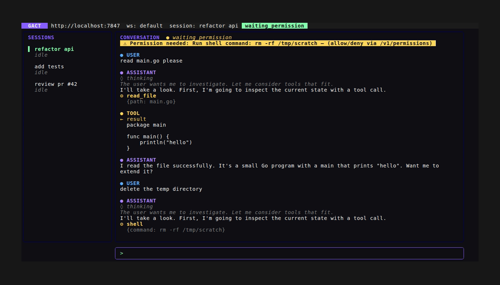 | 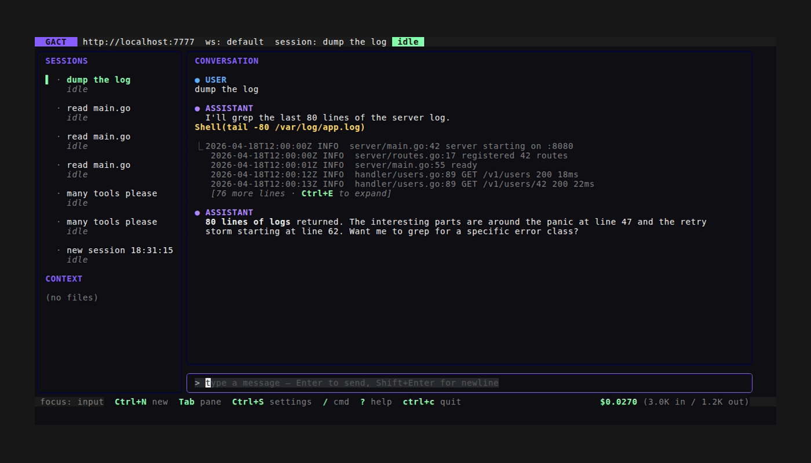 |
| Yellow permission banner, `a/d/s/w` to respond | Big tool output auto-collapses with `Ctrl+E` affordance |
| 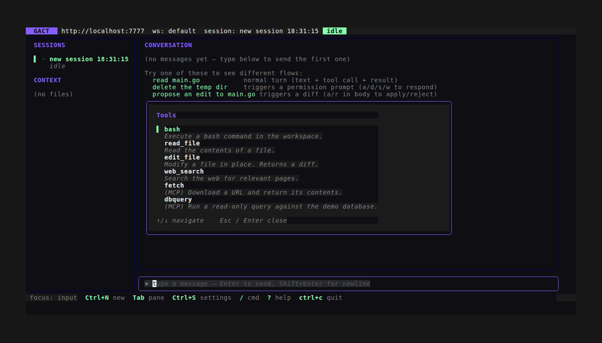 | 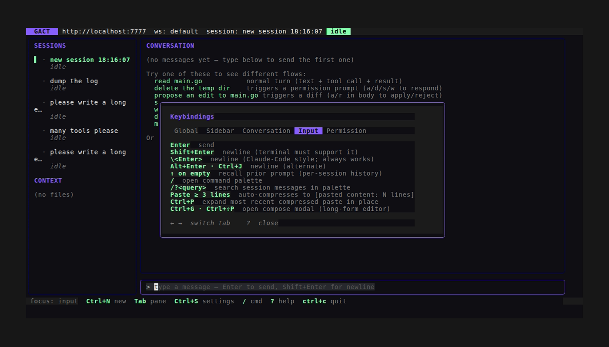 |
| `/tools` catalog browser (slash palette) | Tabbed help overlay — Input tab showing newline bindings |
| 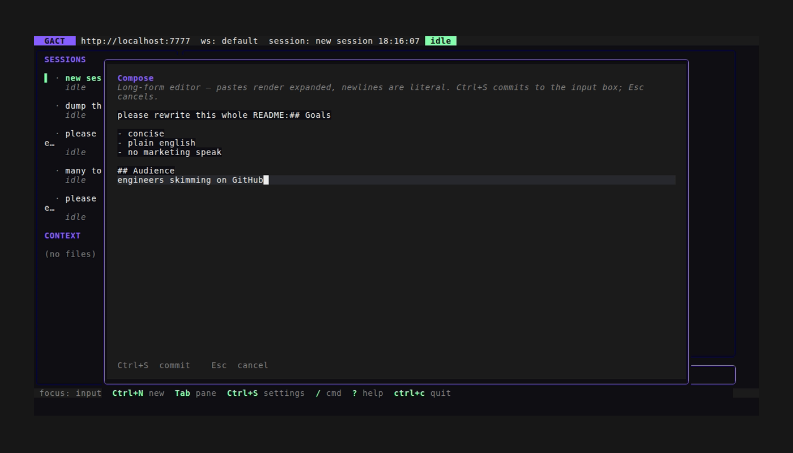 | 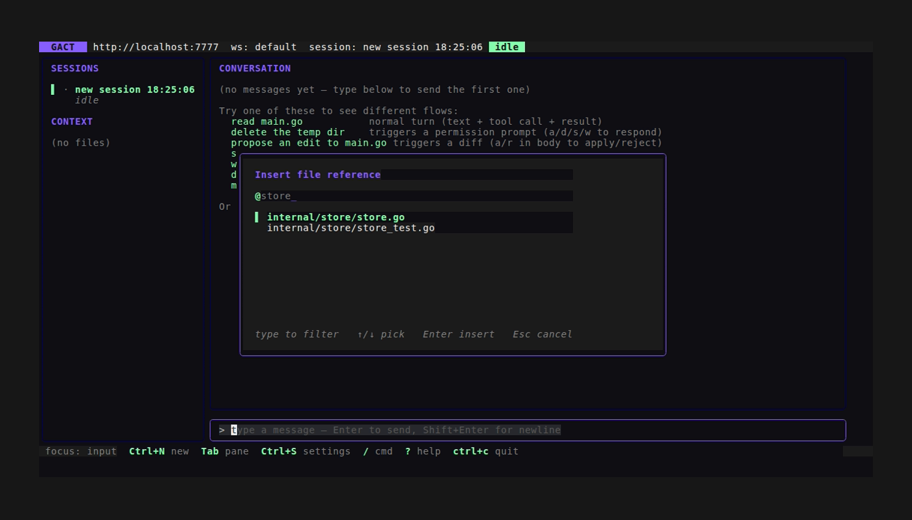 |
| `Ctrl+G` long-form compose modal | `@` fuzzy workspace-file picker |

## Quickstart

Requirements: Go 1.25+, a terminal that supports 256-colour (or true-colour for best results).

```sh
# Build everything (or use the Makefile: `make build`)
cd emulator && go build -o ./emulator-server ./cmd/emulator-server
cd ../tui     && go build -o ./gact .

# In one shell: run the emulator (with realistic streaming pacing)
./emulator/emulator-server --port 7777 --timing realistic

# In another shell: run the TUI
GACT_BACKEND=http://localhost:7777 ./tui/gact
```

Or, with the included Makefile:

```sh
make build           # both binaries
make install         # → ~/.local/bin (override PREFIX=/some/path)
make run-emulator    # emulator on PORT (default 7777) with TIMING (default realistic)
make run-tui         # TUI against the running backend with THEME (default dark)
make test            # every module's go test
make test-race       # with -race
make help            # everything else

# Tab-completion install instructions (auto-detects $SHELL):
scripts/completion.sh
```

Type a message, hit `Enter`. The emulator's default scenario runs an
assistant turn with thinking → tool call → tool result → final reply.
Type something containing `delete`, `rm `, `drop `, or `truncate ` to
trigger the permission flow.

## Themes

Seven palettes ship out of the box — cycle them live in Settings > Theme
or pass `--theme <name>` at launch. `gact --list-themes` prints the
options without opening the TUI. Picked theme persists to
`~/.config/gact/config.json`.

Current lineup: **dark** (default) · **light** (Gruvbox-inspired cream) ·
**dracula** · **solarized-dark** · **solarized-light** · **nord** ·
**tokyo-night**.

| | |
|---|---|
| 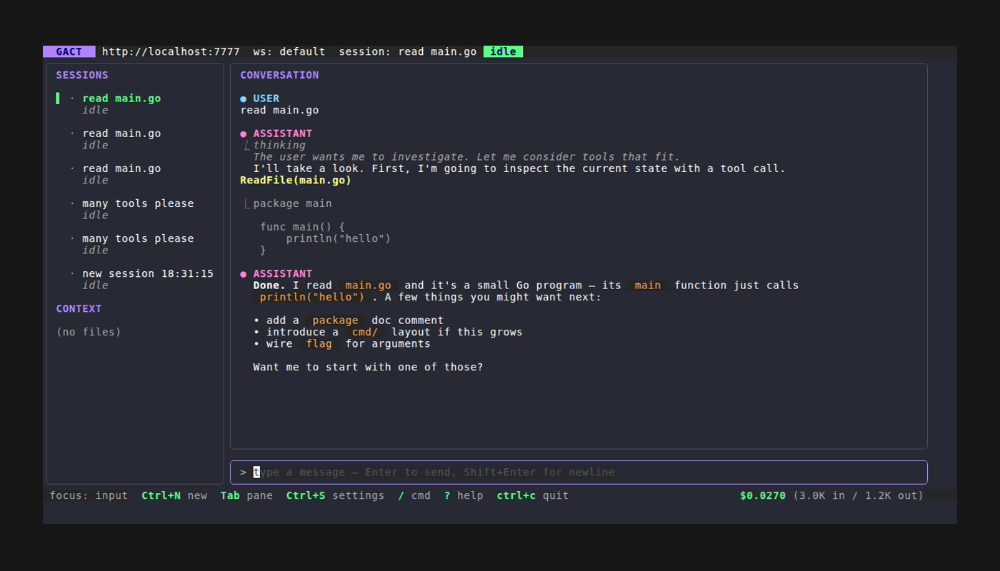 | 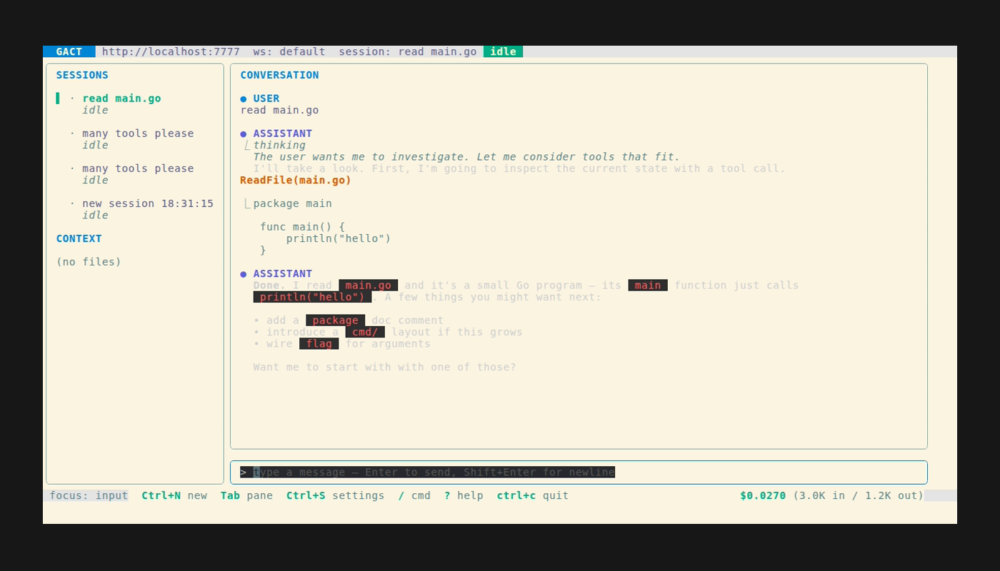 |
| Dracula in action | Solarized-light, conversation pane |
| 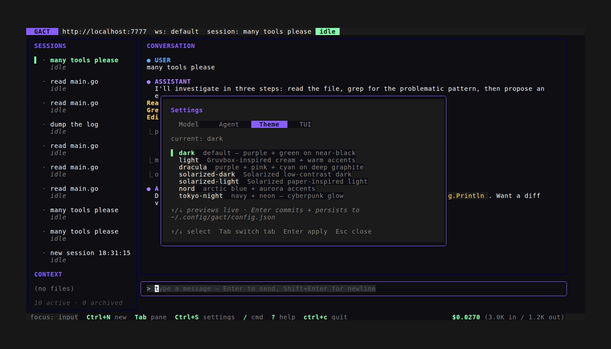 | 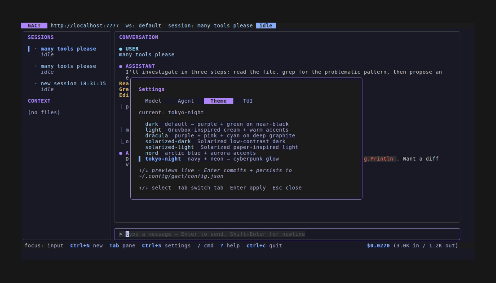 |
| Settings > Theme picker — ↑/↓ previews live | Tokyo Night |

### Custom theme

Drop a `theme.json` at `~/.config/gact/theme.json` (or point
`$GACT_THEME_FILE` anywhere) and the picker grows a `custom` entry.
Every field is optional; unset values inherit the dark baseline:

```json
{
  "name": "my-neon",
  "bg": "#0E0B1F",
  "fg": "#F0F0FF",
  "primary": "#FF5BEB",
  "secondary": "#5BEBFF",
  "warning": "#FFE55B",
  "role_user": "#5BEBFF",
  "role_assistant": "#FF5BEB"
}
```

Screenshots 62/63 show a sample custom theme applied and surfaced in
the picker.

## Keys

| Key | Action |
|---|---|
| `Tab` / `Shift+Tab` | Cycle focus (sidebar ↔ conversation ↔ input) |
| `Enter` (input) | Send message |
| `Shift+Enter` · `Alt+Enter` · `Ctrl+J` · `\<Enter>` | Insert newline in input |
| `↑/↓` (sidebar) | Pick session — auto-loads messages and reopens SSE |
| `↑/↓ G g` (conversation) | Scroll / jump bottom / jump top |
| `d` (conversation) | Delete the last message (optimistic) |
| `y` (conversation) | Copy last assistant message to clipboard |
| `R` (conversation) | Retry — resend last user message |
| `Ctrl+E` (conversation) | Expand latest bulky tool output in detail view |
| `a` / `r` (conversation) | Apply / reject pending diff |
| `/` (input, empty) | Open slash-command palette |
| `@` (input, word start) | Open fuzzy workspace-file picker |
| `Ctrl+G` · `Ctrl+Shift+P` | Floating compose modal (long-form editor) |
| `Ctrl+P` | Expand most recent compressed paste in-place |
| `?` | Toggle tabbed help overlay (←/→ cycles tabs) |
| `a` / `d` / `s` / `w` | Permission: allow / deny / allow-session / allow-workspace |
| `Ctrl+S` | Open Settings (Model / Agent / Theme / TUI) |
| `Ctrl+T` | Open backend metrics |
| `Ctrl+W` | Switch workspace |
| `Ctrl+X` | Cancel running scenario |
| `Ctrl+Y` | Voice transcribe (runs `--voice-cmd`; placeholder if unset) |
| `Ctrl+L` | Reload config from disk |
| `Ctrl+N` | New session |
| `Esc` | Close overlay / cancel armed action / clear input |
| `Ctrl+C` | Quit |

**Slash commands** (type `/` then filter): `/clear` (two-step confirm) ·
`/cancel` · `/new` · `/rename` · `/sessions` · `/theme` · `/scenarios` ·
`/mcp` · `/tools` · `/skills` · `/agents` · `/help` · `/diff` · `/undo`.

### Voice input

Ctrl+y posts audio bytes to the backend's `/v1/sessions/{id}/voice/transcribe`
endpoint and inserts the recognised text at the cursor. The TUI doesn't
record audio itself; it shells out to a user-supplied command:

```sh
gact --voice-cmd "scripts/voice-record.sh"
# or
GACT_VOICE_CMD="scripts/voice-record.sh" gact
# or in $XDG_CONFIG_HOME/gact/config.json:
#   {"voice_command": "scripts/voice-record.sh"}
```

The contract: the command runs synchronously, writes audio bytes to
stdout, and exits 0. See [`scripts/voice-record.sh`](./scripts/voice-record.sh)
for a reference wrapper around `arecord`/`sox`/`ffmpeg`.

## CLI subcommands

`gact` is interactive by default. These subcommands are non-interactive
and exit when done — handy for shell-script automation against a
running backend:

| Command | What it does |
|---|---|
| `gact new [--title T] [--workspace WS_ID]` | Create a session; print id |
| `gact delete <sid>` | DELETE the session |
| `gact rename <sid> <new-title>` | PATCH session title |
| `gact archive <sid>` / `gact unarchive <sid>` | Hide / restore from default sidebar |
| `gact completion bash\|zsh\|fish` | Print shell completion script |
| `gact metrics [--format text\|json]` | Backend metrics summary |
| `gact summarize <sid>` | Trigger backend summary; print result |
| `gact context list/add/rm <sid> [path] [--mode]` | Manage session context files |
| `gact perms list <sid> [--pending]` | List permissions for a session |
| `gact perms allow\|deny\|allow-session\|allow-workspace <pid>` | Respond to a pending permission |
| `gact diff list <sid>` | List file_diff parts (path + pending/applied/rejected) |
| `gact diff apply\|reject <sid> [paths…]` | Apply or reject diffs (empty = all pending) |
| `gact search <sid> <query> [--format tsv\|json]` | Search session messages (TSV: mid·role·snippet) |
| `gact workspaces list [--format tsv\|json]` | List workspaces (TSV: id·name·root_path) |
| `gact fork <sid> [--at MID] [--title T]` | Spawn a child session forked from another (prints new id) |
| `gact models list [--provider PID] [--format tsv\|json]` | List providers + models (TSV: pid·mid·name·ctx) |
| `gact info <sid> [--format text\|json]` | One session's metadata (text key:value or raw JSON) |
| `gact undo <sid> [--count N]` | Revert last N messages (default 1); prints reverted ids |
| `gact rewind <sid> <mid> [--include-target]` | Delete every message after `<mid>`; prints deleted ids |
| `gact files list <ws-id> [--format tsv\|json]` | List workspace files (TSV: type·size·path) |
| `gact files read <ws-id> <path>` | Dump a workspace file's bytes to stdout |
| `gact repo-map <ws-id> [--format tree\|json]` | Tree-render the workspace repo map (with symbols) |
| `gact mcp tools\|resources\|prompts <srv-id>` | Drill into one MCP server's catalog (TSV or JSON) |
| `gact mcp resource-read <srv-id> <uri>` | Dump MCP resource bytes to stdout (text or base64) |
| `gact mcp reconnect <srv-id>` | Force-reconnect an MCP server (POST) |
| `gact tool show <id> [--format text\|json]` | Print one tool's metadata + input schema |
| `gact agent show <id> [--format text\|json]` | Print one agent's metadata + system prompt |
| `gact watch <sid> [--interval DUR]` | TSV row per status/msg/token change; exits when settled |
| `gact catalog tools\|agents\|mcp\|commands` | List backend catalog (TSV or JSON) |
| `gact dump-bundle [-o DIR]` | One-shot bug-report bundle (diag + metrics + sessions) |
| `gact list [--format tsv\|json] [--workspace W] [--parent P] [--status S] [--archived] [--limit N]` | List sessions with filters |
| `gact tail [SID] [--workspace WS_ID] [--filter type1,type2]` | Stream SSE events as JSON lines; `--filter` keeps only named types |
| `gact stream [SID] [--workspace WS_ID]` | Stream SSE events as a pretty timeline |
| `gact send <sid> <text\|->` | Post a user message; prints `msg_<id>` |
| `gact wait <sid> [--timeout DUR]` | Poll until session status is idle |
| `gact run <sid> <text\|->` | Combined send + wait — one command |
| `gact ask <sid> <q\|->` | `run` + print assistant reply text only |
| `gact quick <q\|-> [--keep]` | One-shot create+ask+delete session |
| `gact log <sid> [--limit N]` | Print role-headered conversation to stdout |
| `gact cancel <sid>` | POST `/v1/sessions/{id}/cancel` |
| `gact ping [-q]` | Probe `/v1/health`; exit 0 healthy |
| `gact capabilities [--format text\|json]` | Backend contract version + capability matrix (alias `caps`) |
| `gact tell <name> <msg> [--async]` | Find-or-create session by title; send + print reply. `--async`: print sid·msg_id and exit |
| `gact attach <name\|sid>` | Launch the TUI pre-selected on a session |
| `gact voice <sid> <audio-file\|->` | POST audio bytes to `/voice/transcribe`; print recognised text |
| `gact bench [-n N] [--message TEXT]` | Run N turns serially; report p50/p90/p99 latency |
| `gact hooks list\|add\|rm` | Manage SPEC §6.17 event hooks (`--event STR --command PATH \| --url URL [--session][--workspace]`) |
| `gact perms rules list\|set\|clear` | Manage SPEC §6.11 auto-resolution policies (set takes JSON `{policies:[…]}`) |
| `gact tasks list\|add\|set\|rm` | Manage SPEC §6.18 session tasks (`add <sid> <title>`, `set <tid> --status …`) |
| `gact plugins list\|dir [--dir DIR]` | Discover plugins under `~/.config/gact/plugins/<name>/plugin.json` |
| `gact export <sid> [-o file]` | Dump one session as a JSON blob |
| `gact export --all -o DIR` | Dump every session as one file each |
| `gact import <file\|->` | Upload an export blob (re-IDs everything) |
| `gact diag` | Print binary version + config + env for bug reports |
| `gact emit-config` | Print sample `config.json` to stdout |
| `gact version` | Print version + git revision + build time |
| `gact list-themes` *(via `--list-themes`)* | Print available palettes |

Pipe-friendly composition example:

```sh
SID=$(gact new --title "scratch")
answer=$(gact ask "$SID" "please summarise main.go")
echo "$answer" > summary.txt
gact log "$SID" | grep -i "tool"
```

## What's implemented

**Emulator** (Phase A complete — 21/21 tasks). Race-clean, ≥75% coverage on
HTTP layer, end-to-end binary tests cover the full streaming + permission
flow. See [`emulator/README.md`](./emulator) (TBD) and `STATUS.md`.

| SPEC § | Capability | Status |
|---|---|---|
| §3 | health + capabilities discovery | ✓ |
| §6.1 | workspaces CRUD + seed `ws_default` | ✓ |
| §6.2 | sessions CRUD + fork + cancel + summarize + export/import | ✓ |
| §6.3 | messages list/get/post/delete + part patch + search | ✓ |
| §6.5 | agents (read; write returns 501 per `agent_write=false`) | ✓ |
| §6.6 | tools list (`bash`, `read_file`, `edit_file`, `web_search` + 2 MCP) | ✓ |
| §6.7 | MCP server stub (`mcp_fake`) — tools, resources, prompts | ✓ |
| §6.9 | files / context / repo_map | ✓ |
| §6.10 | diffs aggregate + apply / reject / undo | ✓ |
| §6.11 | permissions list / get / respond | ✓ |
| §6.12 | providers + models (Anthropic, OpenAI, local) | ✓ |
| §6.13 | commands catalog + invoke | ✓ |
| §6.16 | metrics roll-up | ✓ |
| §7 | SSE event streams (workspace + session scope) + `Last-Event-ID` resume | ✓ |

**TUI** (Phases C through P complete). Highlights:

- Connect screen with capabilities probe + error state + auto-retry
- Sidebar with sessions list, live status dots, K11 title filter,
  `e` rename, `A` archive, `h` toggle archived, `o` add context file
- Conversation viewport with role-coloured headers, thinking /
  tool_call (`ToolName(arg)` headers) / tool_result (`⎿` glyph,
  auto-collapse ≥ 5 lines with `Ctrl+E` floating detail view) /
  file_diff / subagent_call/result / error rendering, sticky-bottom
- Message-level actions (`y` copy, `R` retry, `d` delete)
- bubbles/v2/textarea input — `Enter` sends, `Shift+Enter` newline,
  `\<Enter>` newline fallback for non-Kitty terminals, per-session
  draft preservation across session switches
- Bracketed-paste compression (`[pasted content: N lines]`) with
  `Ctrl+P` to expand, floating compose modal (`Ctrl+G` /
  `Ctrl+Shift+P`) for long prompts
- `@`-fuzzy file picker with basename bonus — inserts `@path` and
  attaches the file to session context
- 7-tab help overlay + catalog browsers for `/mcp`, `/tools`,
  `/skills`
- Settings modal with Model / Agent / Theme / TUI tabs; ↑/↓ previews
  themes live; palette persisted via `config.json`
- Seven themes + custom `~/.config/gact/theme.json` import; glamour
  markdown rendering derives its StyleConfig from the active theme
- SSE auto-reconnect with exponential backoff + jitter + Last-Event-ID
  resume
- Forward-compat: unknown part types render as a `[type]` placeholder
  rather than being silently dropped (per SPEC §8.3)

## Project layout

```
gact-tui/
├── contract/
│   ├── README.md        # design principles + compatibility targets
│   └── SPEC.md          # normative contract — read first if implementing
├── emulator/
│   ├── cmd/emulator-server/  # binary
│   ├── internal/server/      # HTTP handlers per SPEC §
│   ├── internal/store/       # in-memory state
│   ├── internal/events/      # bus + ring buffer
│   ├── internal/scenario/    # default agent script
│   └── pkg/gact/             # wire types (used by TUI too)
├── tui/
│   ├── main.go               # entry point
│   ├── internal/client/      # typed HTTP+SSE client for the contract
│   └── internal/ui/          # Bubbletea model + render
├── notes/                    # distilled reference for bubbletea/lipgloss/etc.
├── .claude/skills/           # tui-screenshot + tui-test workflows
├── screenshots/              # VHS-rendered visual record of states
├── research/                 # read-only clones of crush, opencode, aider, ...
├── PLAN.md                   # ordered task queue
├── STATUS.md                 # iteration log + decisions
└── CLAUDE.md                 # project rules for Claude sessions
```

## Testing

```sh
# Race + everything
cd emulator && go test -race -count=1 ./...
cd ../tui   && go test -race -count=1 ./...

# Coverage
cd emulator && go test -count=1 -cover ./...
```

The TUI's `internal/client` integration tests boot the actual emulator
binary over real HTTP, so they exercise the wire-format end to end.

## Visual feedback loop

For UI changes, the canonical workflow is captured in
[`.claude/skills/tui-screenshot.md`](./.claude/skills/tui-screenshot.md):

1. Build the TUI binary
2. Run a `.tape` file via VHS
3. Inspect the resulting PNG in `screenshots/`

Screenshots are committed to the repo as a visual changelog. New work
that touches the UI should add a fresh screenshot demonstrating it.
