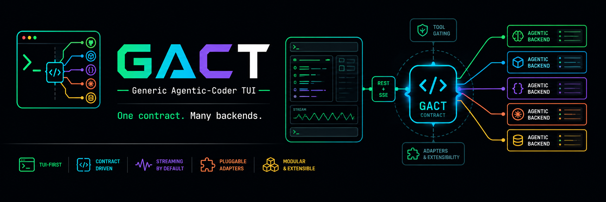
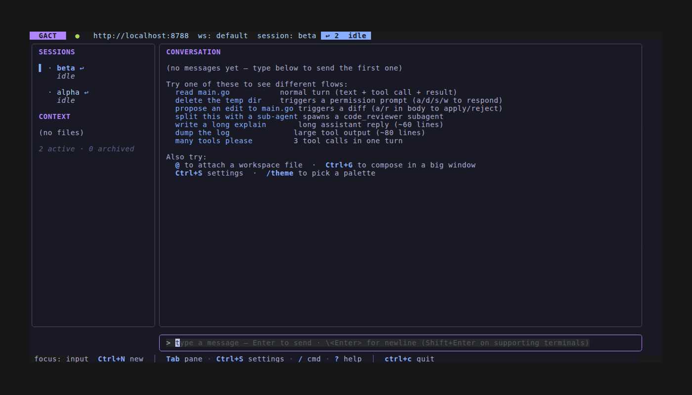
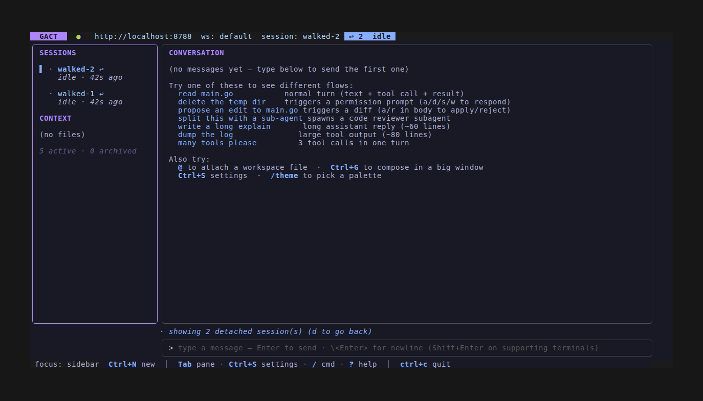

# GACT — Generic Agentic TUI

[](LICENSE)
[](https://go.dev/dl/)
[](contract/SPEC.md)

<p align="center">
  
</p>

**Building a TUI for an agentic loop is hard.** Permission prompts, streaming
partials, tool gating, diff apply/reject, MCP catalogs, SSE reconnects,
per-session state — every coder (Claude Code, OpenCode, Crush, Goose, …)
re-solves these in a slightly different way and locks you into their UI.

**GACT inverts that:** define the wire contract once, build one good TUI,
then write thin adapters for each backend. If your agent speaks
[**GACT v0.2**](contract/SPEC.md) — REST + SSE — the TUI works. The
canonical reference implementation is [iowarp/clio-agent](https://github.com/iowarp/clio-agent),
a scientific-data agent that supports **28 of 30** v0.2 capabilities
end-to-end (only LSP + voice intentionally out). See
[`screenshots/README.md`](screenshots/README.md) for live captures of every advertised
feature working through the TUI. **Extendable** (drop in a new adapter), **modifiable**
(lipgloss themes + Bubbletea components all the way down), **scriptable**
(~70 CLI subcommands alongside the interactive TUI).

|  |  |
|---|---|
|  |  |
| Mid-stream — running badge, thinking + tool call | Claude-Code-style `ToolName(arg)` headers + `⎿` continuation |
|  |  |
| Header `↩ N` chip + sidebar markers for Ctrl+Z-detached sessions | `d` toggles detached-only view; `SESSIONS · detached` title |
|  |  |
| `Ctrl+G` long-form compose modal | `@` fuzzy workspace-file picker |

## Why

Every agentic coder ships its own UI. They diverge on small things
(themes, keybindings, paste handling) and lock you into one provider.
GACT inverts that: **define the wire contract once, build one good UI,
then write thin adapters for each backend.** Adapters live in
[`adapters/`](adapters/); the contract and conformance suite live in
[`contract/`](contract/).

## Quick tour

Two ways to run — pick the one that matches your stack:

**Against your real agent (Claude Code):**
```sh
gact agent deploy claudecode myclaude   # spawns the adapter detached
gact connect myclaude                   # interactive TUI
# Ctrl+Z detaches the TUI; the adapter keeps running.
gact resume                             # comes back where you were
gact agent stop myclaude                # when you're done for the day
```

**Against the reference emulator (no API keys, no network):**
```sh
emulator-server --port 7777 --timing realistic &
GACT_BACKEND=http://localhost:7777 gact
```

**Scripting without the TUI:**
```sh
gact dashboard --sort newest                      # live sessions table
gact ask <sid> "summarise the diff"               # one-shot Q&A
gact log <sid> --role assistant --grep "error"    # filter conversation
gact agent list --format json                     # registered agents
gact session create --title "scratch"             # CRUD alias layer
```

Inside the TUI: type a message → watch the thinking stream, tool call
fire, tool result render, reply stream back char-by-char. Try `delete
the temp dir` for the permission flow, `propose an edit to main.go` for
a `file_diff` you can `a`pply or `r`eject, or `read main.go` three times
to see the emulator's per-session variant cycling.

## Install

Requires Go 1.25+ and a 256-color (or true-color) terminal.

```sh
git clone https://github.com/JaimeCernuda/gact-tui
cd gact-tui
make build && make install        # → ~/.local/bin/{gact,emulator-server}
```

Optional local file previews for images, PDFs, HTML, and scientific formats use
external renderers when available. Check or install them with
`make file-renderers-check`, `make install-file-renderers`, or see
[`docs/FILE_RENDERERS.md`](docs/FILE_RENDERERS.md).

## Drive a real backend

Adapters translate **GACT v0.1 ↔ a vendor-specific protocol.** Each one
ships as a sidecar binary you run between the TUI and the upstream.
Each passes the [`contract/conformance`](contract/conformance/) suite
so the TUI behaves identically across all of them.

| Backend | Adapter | Status |
|---|---|---|
| [Claude Code](https://github.com/anthropics/claude-code) (Go, recommended) | [`adapters/claudecode/`](adapters/claudecode/) | Native Go, drives `claude --output-format stream-json` directly — single binary, no Python runtime. 16/16 conformance sections ✓ |
| Claude Code (Python) | [`adapters/claude-agent-sdk-server/`](adapters/claude-agent-sdk-server/) | Python sidecar on [`claude-agent-sdk`](https://github.com/anthropics/claude-agent-sdk-python) — retained for reference; the Go adapter above is feature-equivalent |
| [OpenCode](https://github.com/opencode-ai/opencode) | [`adapters/opencode/`](adapters/opencode/) | Go proxy of the OpenCode HTTP API |
| [Crush](https://github.com/charmbracelet/crush) | [`adapters/crush/`](adapters/crush/) | Go proxy of the Crush HTTP API |
| [Goose](https://github.com/block/goose) | [`adapters/goose/`](adapters/goose/) | Go proxy of the goosed HTTP API — sessions/messages read+write + SSE; 8/8 conformance sections ✓ |
| [CLIO Agent](https://github.com/iowarp/clio-agent) | *(in-process, Python)* — `clio-agent-gact` console script ships with clio-agent's `tui-integration` branch | v0.2 native: agent_routing (tier-1 → tier-2 experts), memory stats, integration_health (`/doctor`), tool_telemetry events, cost tracking, forks, search, permissions, two-phase edits, nanoagent spawns. `gact agent deploy clio my-clio` deploys it. See [Quick start with CLIO + Claude Max](#quick-start-with-clio--claude-max) below. |

## Quick start with CLIO

The one-line clio installer (released in v0.6 — drops a `clio`
launcher onto your PATH) is the supported path:

```sh
# Linux / macOS
curl -fsSL https://raw.githubusercontent.com/iowarp/clio-agent/main/install/install.sh | bash
clio                                          # ensures server up, attaches TUI

# Windows (PowerShell)
irm https://raw.githubusercontent.com/iowarp/clio-agent/main/install/install.ps1 | iex
clio
```

On first launch the TUI pops the LM-provider modal — pick a preset
(OpenAI, Anthropic, OpenRouter, LM Studio, Ollama, Codex
subscription, ALCF Sophia/Metis), paste an API key if needed, save.
The next turn uses the new LM. To swap mid-session: `Ctrl+S` →
Settings → Model → Change provider.

The TUI renders a real LM turn through CLIO's planner → tier-2
expert → answer + routing badge + ARC cache chip + live token/cost
rollup in the footer. Tools (HDF5, Parquet MCP servers) need
additional config — see [CLIO's provider
docs](https://github.com/iowarp/clio-agent/blob/main/docs/providers/README.md)
for the full recipe.

## Build it for your own backend

1. **Read the contract.** Every endpoint your adapter has to implement
   (or explicitly opt out of via `capabilities.<flag> = false`) is in
   [`contract/SPEC.md`](contract/SPEC.md).
2. **Fork an existing adapter.** `adapters/crush/` or `adapters/opencode/`
   are ~400 LOC each and follow the same shape: `server.go` (HTTP
   router), `transport.go` (upstream HTTP client), `translate.go`
   (schema ↔ GACT).
3. **Run conformance.** Add a `conformance_test.go` that boots your
   adapter against a mock upstream and calls
   `conformance.Run(t, srv.URL, opts)`. The suite
   ([`contract/conformance/`](contract/conformance/)) locks 16+
   sections: session CRUD, message + SSE envelope shapes (SPEC §7.2),
   MCP per-server drill-downs, diff apply/reject, file_diff Parts,
   agents, tools, metrics, workspaces, permissions control protocol.
4. **Open a PR.** If conformance passes, the TUI just works.

The TUI itself is feature-gated on `GET /v1/capabilities`: adapters
that don't implement e.g. `capabilities.diffs` automatically hide the
diff workflow in the UI — no per-adapter TUI code. Same for tools,
agents, MCP, permissions, voice.

## What you get

Highlights — full keybind / CLI / capability reference in
[`docs/FEATURES.md`](docs/FEATURES.md):

**TUI**

- **7 themes** + custom JSON palettes + Gruvbox-warm / Tokyo Night / Dracula
- **Settings modal**: model + agent picker, theme cycler, TUI prefs
  (collapse threshold, cost warn/danger tokens, paste compress, intro
  splash toggle)
- **`@`-file picker** (fuzzy basename), **`/`-slash palette**,
  **`Ctrl+G` compose modal** for long prompts
- **Bracketed-paste compression** → `[pasted content: N lines]` placeholder,
  `Ctrl+P` expands
- **Permission flow**: `a`/`d`/allow-`s`ession/allow-`w`orkspace + a
  config rules engine to auto-resolve
- **Diff workflow**: `a`/`r` apply/reject `file_diff` parts inline
- **Session resume**: `Ctrl+Z` clean detach → local `detached.json` →
  `gact attach` / `gact resume` → back where you were. 11 UX surfaces
  (header chip, sidebar `↩` marker, sidebar `d` filter, dashboard
  column, `gact info`, `gact detached`, etc.) all read the same
  registry source of truth.

**CLI** (~70 subcommands, see [`docs/FEATURES.md`](docs/FEATURES.md)
for the full list)

- `gact ask <sid>`, `gact send`, `gact wait`, `gact run`
- `gact log <sid> --role assistant --grep "error" --since 1h --format json`
- `gact follow <sid> --role assistant --grep pattern` (tail-f)
- `gact dashboard --sort newest --detached-only --format json`
- `gact detached --probe --prune-dead` (registry management)
- `gact grep <query> --role user` (cross-session full-text)
- `gact dump-bundle` (diag + metrics + sessions + detached.json for
  bug reports)
- `gact completion bash|zsh|fish`

**Plugin loader** under `~/.config/gact/plugins/<name>/plugin.json`

## Tests + coverage

Run everything locally:

```sh
make test        # emulator + tui + conformance + every adapter
make test-race   # same, under -race
```

Current coverage (from `go test -cover`):

| Module | Coverage |
|---|---|
| `tui/internal/ui` | 67.6% |
| `tui/internal/config` | 77.5% |
| `tui/internal/plugins` | 72.9% |
| `tui/internal/client` | 39.5% |
| `emulator/internal/events` | 87.3% |
| `emulator/internal/scenario` | 83.3% |
| `emulator/internal/store` | 72.3% |
| `emulator/internal/server` | 67.5% |

All tests pass. Screenshot-driven UI changes re-record via `vhs` tapes
in `tui/testdata/tapes/screenshot_*.tape` — the `.claude/skills/tui-screenshot.md`
workflow is documented.

## Project layout

- [`tui/`](tui/) — the Bubbletea client + ~70 CLI subcommands
- [`emulator/`](emulator/) — reference backend (boots in ~50ms, no deps)
- [`contract/`](contract/) — **[SPEC.md](contract/SPEC.md)** + the
  conformance suite every adapter must pass
- [`adapters/`](adapters/) — Claude Code (Go + Python), OpenCode,
  Crush, Goose bridges
- [`docs/FEATURES.md`](docs/FEATURES.md) — exhaustive reference:
  every keybinding, CLI command, capability matrix, theme, voice
  plumbing
- [`docs/TUI_ONE_ZERO_RELEASE_CHECKLIST.md`](docs/TUI_ONE_ZERO_RELEASE_CHECKLIST.md)
  — current TUI 1.0 release gate: installed-binary identity, CI,
  visual-loop, and manual terminal checks

## Contributing

Conventional commits (`feat:`, `fix:`, `test:`, `docs:`, `chore:`,
`refactor:`). Run `make test-race` before pushing. UI changes need a
fresh screenshot in `screenshots/` — see
[`.claude/skills/tui-screenshot.md`](.claude/skills/tui-screenshot.md).

## License

MIT — see [LICENSE](LICENSE).
