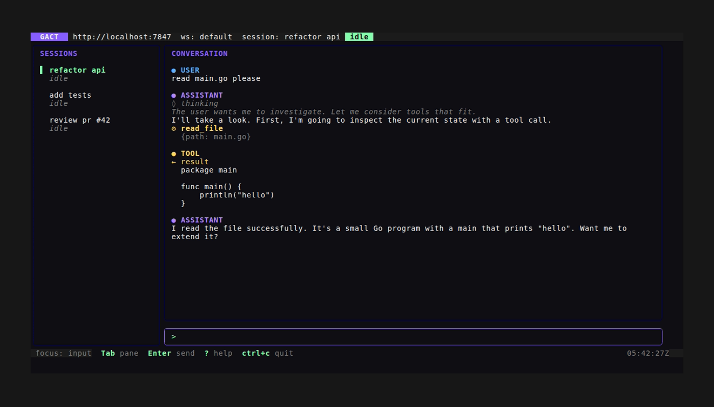
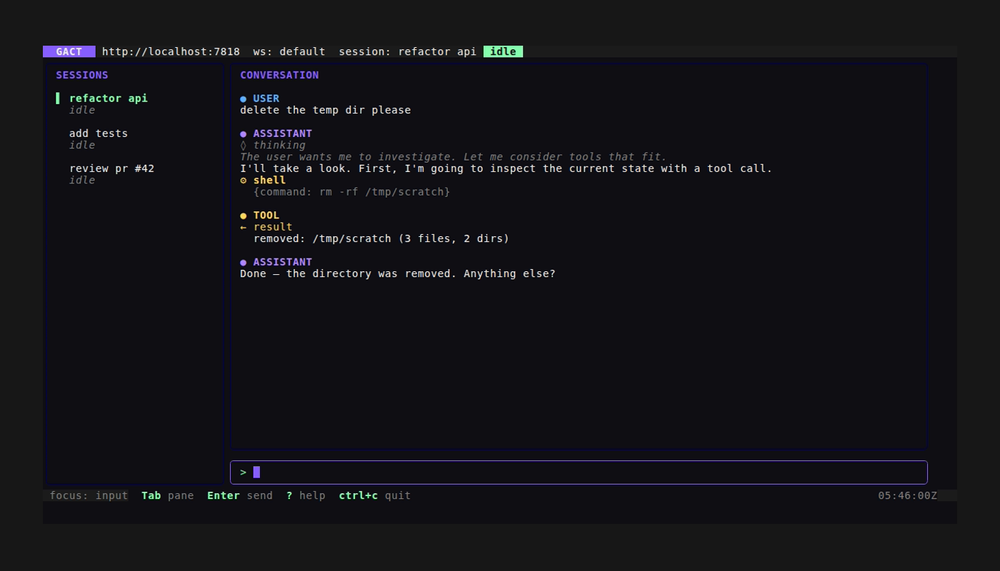
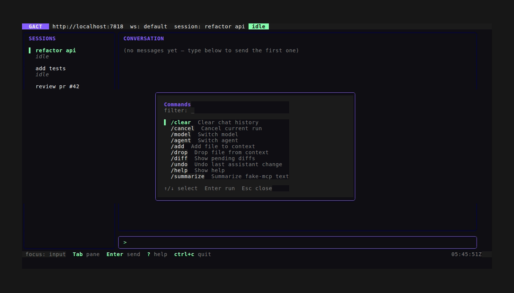
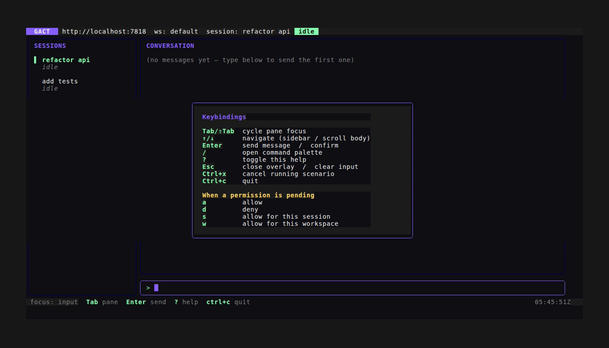

# GACT — Generic Agentic-Coder TUI

A terminal frontend for any agentic-coder backend that conforms to the **GACT v0.1** REST + SSE contract. Two pieces:

- [`emulator/`](./emulator) — a fully-implemented backend that synthesizes realistic agent turns. Boots in ~50ms, no external dependencies.
- [`tui/`](./tui) — a Bubbletea client that drives any GACT-compliant backend (the emulator, or your own).

The contract itself is in [`contract/SPEC.md`](./contract/SPEC.md).

## What it looks like

| | |
|---|---|
|  |  |
| Mid-stream — running badge, thinking + tool call with parsed args | Completed conversation, idle status |
|  |  |
| Yellow permission banner, `waiting_permission` status | After pressing `a` (allow), scenario continued and completed |
|  |  |
| Slash-command palette (filter as you type) | Help overlay (`?` to toggle) |

## Quickstart

Requirements: Go 1.25+, a terminal that supports 256-colour (or true-colour for best results).

```sh
# Build
cd emulator && go build -o ./emulator-server ./cmd/emulator-server
cd ../tui     && go build -o ./gact .

# In one shell: run the emulator (with realistic streaming pacing)
./emulator/emulator-server --port 7777 --timing realistic

# In another shell: run the TUI
GACT_BACKEND=http://localhost:7777 ./tui/gact
```

Type a message, hit `Enter`. The emulator's default scenario runs an
assistant turn with thinking → tool call → tool result → final reply.
Type something containing `delete`, `rm `, `drop `, or `truncate ` to
trigger the permission flow.

## Keys

| Key | Action |
|---|---|
| `Tab` / `Shift+Tab` | Cycle focus (sidebar ↔ conversation ↔ input) |
| `Enter` (input) | Send message |
| `Enter` (sidebar) | Confirm session selection (jumps to input) |
| `↑/↓` (sidebar) | Pick session — auto-loads messages and reopens SSE |
| `↑/↓ G g` (conversation) | Scroll / jump bottom / jump top |
| `/` (input, empty) | Open slash-command palette |
| `?` | Toggle help overlay |
| `a` / `d` / `s` / `w` | Permission: allow / deny / allow-session / allow-workspace |
| `Ctrl+x` | Cancel currently-running scenario |
| `Esc` | Close overlay / clear input |
| `Ctrl+c` | Quit |

## What's implemented

**Emulator** (Phase A complete — 21/21 tasks). Race-clean, ≥75% coverage on
HTTP layer, end-to-end binary tests cover the full streaming + permission
flow. See [`emulator/README.md`](./emulator) (TBD) and `STATUS.md`.

| SPEC § | Capability | Status |
|---|---|---|
| §3 | health + capabilities discovery | ✓ |
| §6.1 | workspaces CRUD + seed `ws_default` | ✓ |
| §6.2 | sessions CRUD + fork + cancel + summarize + export/import | ✓ |
| §6.3 | messages list/get/post/delete + part patch + search | ✓ |
| §6.5 | agents (read; write returns 501 per `agent_write=false`) | ✓ |
| §6.6 | tools list (`bash`, `read_file`, `edit_file`, `web_search` + 2 MCP) | ✓ |
| §6.7 | MCP server stub (`mcp_fake`) — tools, resources, prompts | ✓ |
| §6.9 | files / context / repo_map | ✓ |
| §6.10 | diffs aggregate + apply / reject / undo | ✓ |
| §6.11 | permissions list / get / respond | ✓ |
| §6.12 | providers + models (Anthropic, OpenAI, local) | ✓ |
| §6.13 | commands catalog + invoke | ✓ |
| §6.16 | metrics roll-up | ✓ |
| §7 | SSE event streams (workspace + session scope) + `Last-Event-ID` resume | ✓ |

**TUI** (Phase C — 12/12 tasks done; D & E in progress).

- Connect screen with capabilities probe + error state
- Sidebar sessions list with live status
- Conversation viewport with role-coloured headers, thinking/tool
  call/tool result/file diff/error rendering, sticky-bottom scroll
- Input box with cursor blink
- Footer with focus indicator + key hints + UTC clock
- Live SSE consumer: streaming text deltas, status changes, permissions
- Permission banner with keyboard action keys (a/d/s/w)
- Slash-command palette (fuzzy-filterable from `/v1/commands`)
- Help overlay
- Cancel current run (Ctrl+x)
- Forward-compat: unknown part types render as a `[type]` placeholder
  rather than being silently dropped (per SPEC §8.3)

**Yet to do**: Phase D golden tests for TUI states, Phase E polish
(themes, connection resilience, better empty states), Phase F stretch
(real backend adapter for Crush/OpenCode, voice, markdown rendering).

## Project layout

```
gact-tui/
├── contract/
│   ├── README.md        # design principles + compatibility targets
│   └── SPEC.md          # normative contract — read first if implementing
├── emulator/
│   ├── cmd/emulator-server/  # binary
│   ├── internal/server/      # HTTP handlers per SPEC §
│   ├── internal/store/       # in-memory state
│   ├── internal/events/      # bus + ring buffer
│   ├── internal/scenario/    # default agent script
│   └── pkg/gact/             # wire types (used by TUI too)
├── tui/
│   ├── main.go               # entry point
│   ├── internal/client/      # typed HTTP+SSE client for the contract
│   └── internal/ui/          # Bubbletea model + render
├── notes/                    # distilled reference for bubbletea/lipgloss/etc.
├── .claude/skills/           # tui-screenshot + tui-test workflows
├── screenshots/              # VHS-rendered visual record of states
├── research/                 # read-only clones of crush, opencode, aider, ...
├── PLAN.md                   # ordered task queue
├── STATUS.md                 # iteration log + decisions
└── CLAUDE.md                 # project rules for Claude sessions
```

## Testing

```sh
# Race + everything
cd emulator && go test -race -count=1 ./...
cd ../tui   && go test -race -count=1 ./...

# Coverage
cd emulator && go test -count=1 -cover ./...
```

The TUI's `internal/client` integration tests boot the actual emulator
binary over real HTTP, so they exercise the wire-format end to end.

## Visual feedback loop

For UI changes, the canonical workflow is captured in
[`.claude/skills/tui-screenshot.md`](./.claude/skills/tui-screenshot.md):

1. Build the TUI binary
2. Run a `.tape` file via VHS
3. Inspect the resulting PNG in `screenshots/`

Screenshots are committed to the repo as a visual changelog. New work
that touches the UI should add a fresh screenshot demonstrating it.
