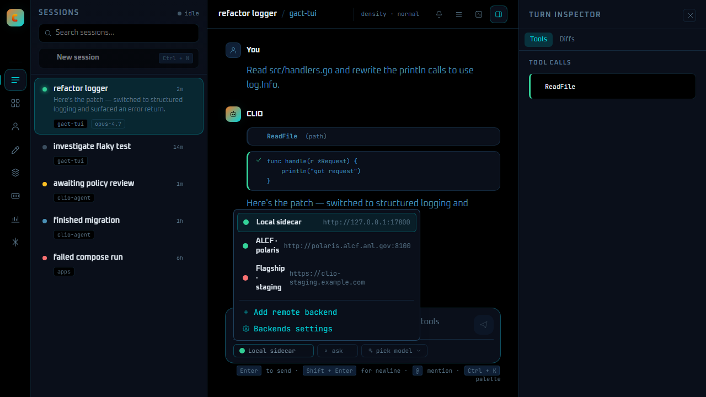

# CLIO Desktop + Web

CLIO Desktop is a non-terminal frontend for the
[CLIO Agent](https://github.com/iowarp/clio-agent) — a scientific
data-management agent that speaks the GACT v0.2 contract. It bundles
the agent as a managed sidecar, so opening the app is enough to start
a conversation. The same UI also ships as a pure-web app for the
no-install case.

| | What it is | When to use it |
|---|---|---|
| **CLIO Desktop** | Native Tauri 2 shell that bundles `clio-agent` and auto-starts it on launch | Default — installs once, double-click to chat. Federation, SSH-tunneled remote backends, OS notifications, tray icon. |
| **CLIO Web** (`@clio/web`) | The same SolidJS UI shipped as a static bundle | Already have `clio-agent` running locally and just need a browser tab. Degraded-mode: no SSH, no tray, no OS keychain. |
| **gact TUI** (sibling repo) | The terminal UI for power users | Headless servers, SSH-only environments, keyboard-only workflows. |

All three speak the same wire contract (`contract/SPEC.md`).

---

## Download

Tagged releases live at
<https://github.com/iowarp/gact-tui/releases>. The most recent
`clio-desktop-v*` tag ships:

- **Windows** — `CLIO-Desktop_<ver>_x64-setup.exe`, `.msi`
- **macOS (Apple Silicon)** — `CLIO-Desktop_<ver>_aarch64.dmg`
- **macOS (Intel)** — `CLIO-Desktop_<ver>_x64.dmg`
- **Linux** — `.deb`, `.AppImage`, `.rpm`
- **Pure web** — `clio-web-<ver>.zip` (`dist/` ready to serve)
- `SHA256SUMS.<triple>.txt` for each platform

> **All builds are unsigned in the v0.9 release.** Signing arrives in
> v1.0. See [INSTALL.md](INSTALL.md) for the per-OS trust prompts.

---

## What you get



- A chat shell with sessions, sidebar, transcript with verbose / normal
  / summary density, and a composer that streams responses token by
  token over SSE.
- Inline permission cards with **Allow once**, **For this session**,
  **Always for this tool**, **Always on this server**, and **Deny**.
- Multi-buffer **diff review** with per-hunk Apply / Reject.
- **Cmd+K / Ctrl+K** slash palette, **@-mention** picker for files /
  agents / tools.
- Multi-backend picker — register a remote backend over HTTP or open
  an SSH tunnel from the desktop shell (`ssh -L`, authenticating via
  ssh-agent or an unencrypted key file; no secrets are stored).
- Tray icon + OS notifications when a run finishes and the window is
  unfocused.

---

## How it works at first run

1. Installer drops the Tauri shell + a per-triple **launcher binary**
   (`binaries/clio-agent-<triple>{.exe}`) under `bundle.externalBin`.
2. On launch, the Rust supervisor allocates a free localhost port,
   mints a 32-byte bearer token, spawns the launcher with
   `--host 127.0.0.1 --port <N> --token <T>`, and waits for
   `/v1/capabilities` to return 200.
3. The launcher resolves the real `clio-agent-gact` server binary
   (system install → PATH → per-OS install prefix matching upstream
   `clio` installer) and execs it with the bind args.
4. Frontend mounts on top of the localhost server; URL + bearer flow
   from the Rust supervisor through a `get_backend()` Tauri command —
   never seen or pasted by the user.

Full sequence in [FIRST-RUN.md](FIRST-RUN.md).

---

## Backend ports & default host

Two different servers, two different default ports — don't conflate them:

| Port | Server | Role |
|---|---|---|
| **17800** | `clio-agent` (clio) | The shipped product backend the web + desktop UIs talk to. The web app's default backend URL lives in one place, `apps/web/src/backendDefaults.ts`. |
| **7777** | the emulator / gact TUI | The Go emulator default (`emulator/cmd/emulator-server/main.go`) and the TUI's dev default (`tui/main.go`) — a separate contract-conformance server, **not** the product backend. Changing the TUI's dev default is an owner decision and is intentionally left unchanged. |

**Host split (`127.0.0.1` vs `localhost`).** `backendDefaults.ts` exports
the default at port 17800 in both host forms and preserves each existing
call site's host rather than flipping everything to one:

- `DEFAULT_BACKEND_URL` — `http://127.0.0.1:17800` (connect form, fixture
  seeds).
- `DEFAULT_BACKEND_URL_LOCALHOST` — `http://localhost:17800` (pure-web
  splash probe, remote-backend wizard prefill).

The pure-web candidate list (`routes/splashBackend.ts`) probes both forms
in order, and both are pinned by tests, so the two host forms are kept
distinct on purpose.

---

## Build from source

```sh
cd apps
pnpm install
pnpm fetch-sidecar        # builds the Go launcher for the host triple
pnpm --filter @clio/web build
pnpm --filter @clio/desktop tauri:build         # release installer
pnpm --filter @clio/desktop tauri:build:debug   # debug, no installer
pnpm --filter @clio/web test:visual             # Playwright proofs
```

CI lives in [`.github/workflows/apps.yml`](../.github/workflows/apps.yml).
On tag `clio-desktop-v*` it builds the unsigned installer matrix
(windows-latest + macos-14 + macos-13 + ubuntu-22.04) and attaches
the artifacts + SHA256 sums to the matching GitHub Release.

## Where things live

- `apps/core/`  — `@clio/core` — shared TypeScript GACT v0.2 client
  (HTTP + SSE wire, transcript reducers, backend registry).
- `apps/web/`   — `@clio/web` — SolidJS frontend. Same bundle ships
  inside the Tauri shell and as the pure-web build.
- `apps/desktop/` — `@clio/desktop` — Tauri 2 shell. Rust supervisor,
  SSH tunnel manager, tray icon, OS notifications.
- `apps/desktop/sidecar-launcher/` — Go program bundled as the Tauri
  `externalBin`. Resolves & execs the real `clio-agent-gact`.

## Other docs

- [INSTALL.md](INSTALL.md) — per-OS install + unsigned trust prompts
- [FIRST-RUN.md](FIRST-RUN.md) — sidecar lifecycle, port + token, state
- [SECURITY.md](SECURITY.md) — bearer storage, CSP, allowlist, SSH keys
- [STATUS.md](STATUS.md) — current build state
- [PLAN.md](PLAN.md) — ordered queue of follow-up work
- [HARNESS.md](HARNESS.md) — visual loop, CI shape, commit conventions
- [CLAUDE.md](CLAUDE.md) — session rules for AI coders working here

## License + citation

Same as the parent repo (BSD-3-Clause). If you cite CLIO in scientific
work please reference [`iowarp/clio-agent`](https://github.com/iowarp/clio-agent).
