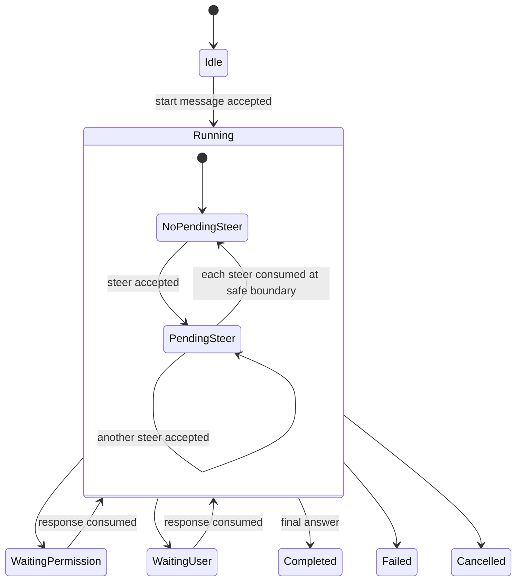
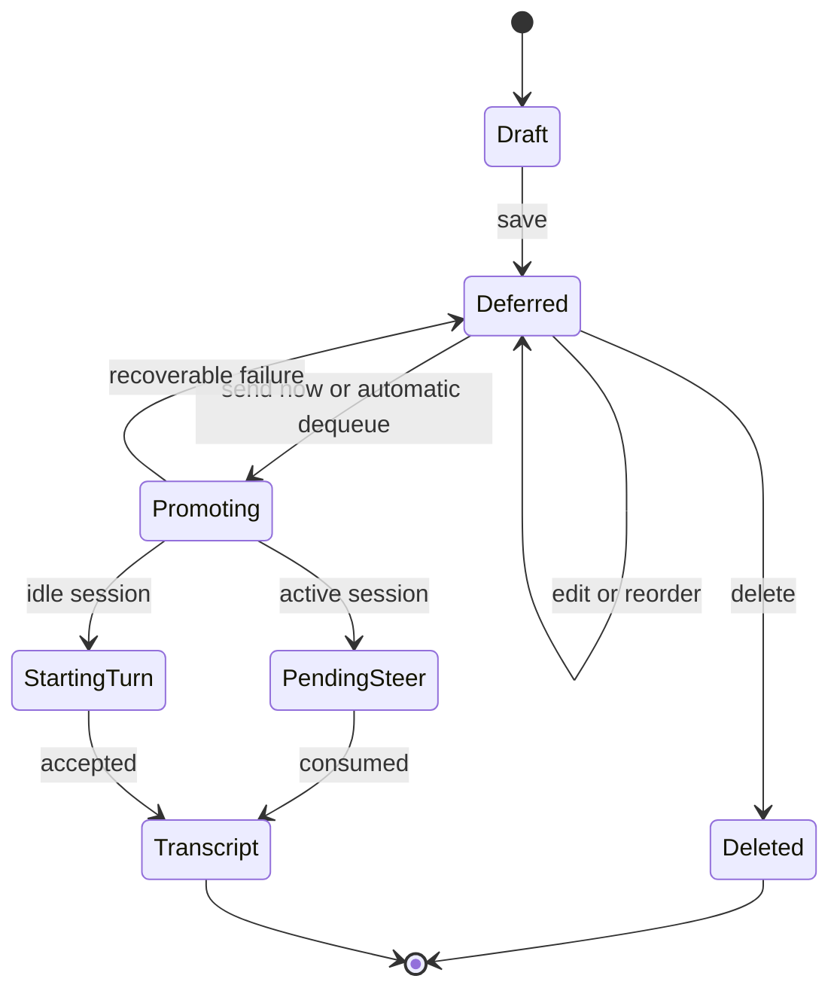
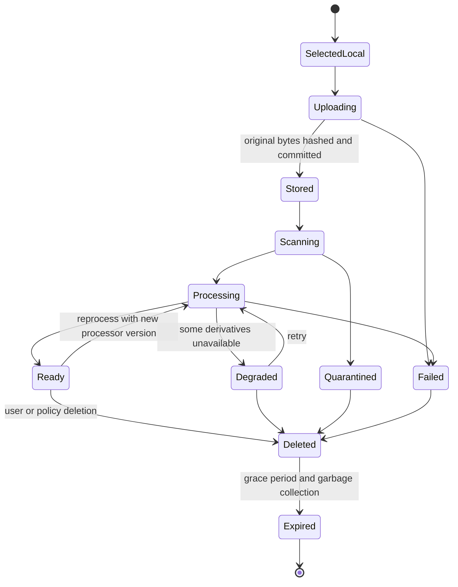
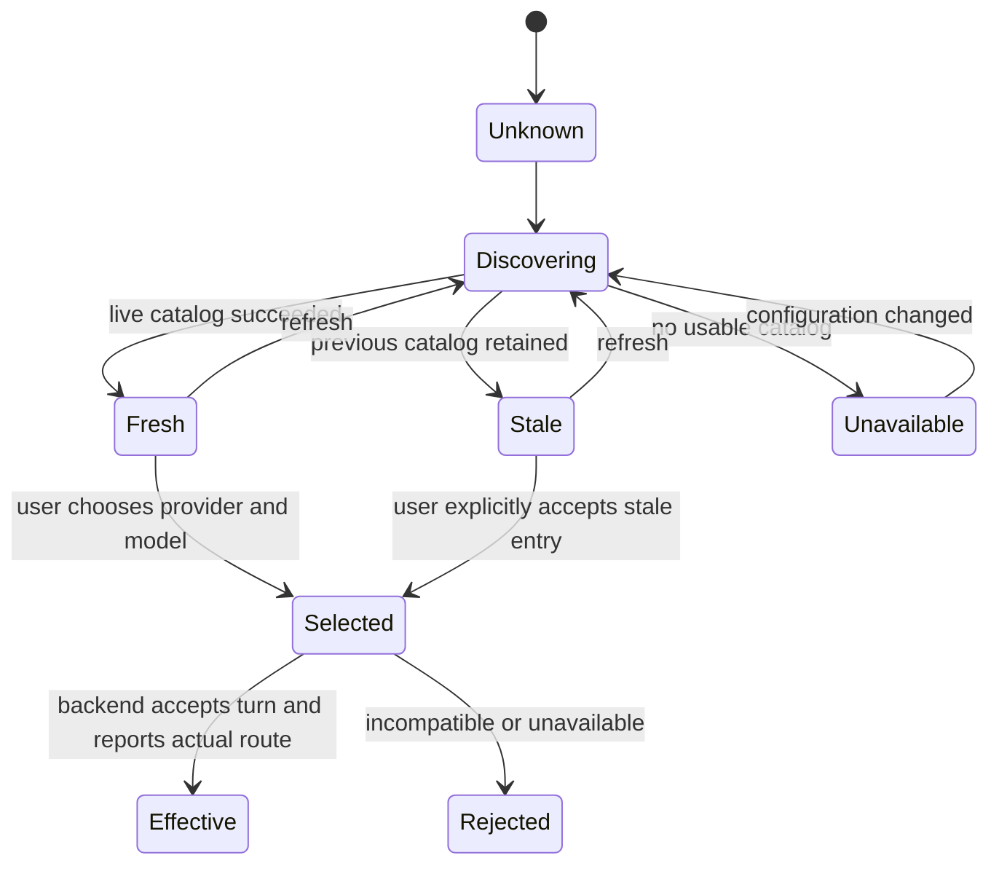

# CLIO Composer, Steering, Queue, Model, and Resource Architecture

**Research date:** 2026-08-30  
**Status:** Architecture recommendation and migration contract  
**Product contract:** [`docs/design/composer-steering-attachments-research-brief.md`](../../composer-steering-attachments-research-brief.md)

## Executive conclusion

CLIO should expose three different user intents, backed by three different service states:

1. **Start a turn** when the session is idle.
2. **Steer the active turn** when the session is running. The user's actual message is immediately shown in the transcript with a dashed border. When CLIO consumes it at a safe boundary, the same message becomes an ordinary human transcript message. There is no replacement row, status sentence, or special delivered object.
3. **Defer a future message** into a durable, editable, reorderable list that is not yet part of the transcript.

The current backend already has the most important primitive for steering: it accepts a busy-session message, preserves a message ID, queues it for the loop inbox, and publishes the ordinary message only when consumed. It does **not** yet provide a durable deferred-message list, durable pending-steer recovery, safe identity handling for multiple coalesced steers, or a resource-upload contract. The frontend currently ignores the files emitted by the sourced AI Elements prompt input and visually describes steering as a special operation rather than reconciling the actual human message.

Uploaded content should become a first-class **CLIO resource**. CLIO owns immutable original bytes, authorization, retention, processing status, structured derivatives, and provenance. Docling's typed document tree is a versioned derivative and Markdown is only one lossy rendering of it. A delivery planner then chooses provider-native input, sandbox mounting, retrieval/bounded document tools, or a derived representation according to the task, file type, model capabilities, privacy policy, and user consent. “Send every binary,” “convert every document to PDF,” and “flatten everything to Markdown” are all rejected as universal strategies.

## Evidence model

This report labels claims implicitly by their source:

- **Current:** observed in the four checked-out CLIO repositories.
- **Protocol:** defined by an official provider, MCP, Docling, or web-platform contract.
- **Product precedent:** documented by a mature agent product.
- **Recommendation:** the proposed CLIO contract, derived from the preceding evidence.

The investigation used source inspection in:

- `gact-tui-node-revamp` for the React composer, AI Elements components, model picker, and GACT repository.
- `clio-agent` for message submission, loop inbox, context files, provider discovery, artifacts, and capabilities.
- `clio-kit` for MCP-facing document and web-search adapters.
- `clio-web-search` for upload custody, hashing, Docling processing, retention, and result structure.

Official documentation was preferred over blogs and screenshots. Product documentation is used for interaction precedents, not as proof of CLIO behavior.

## Binding product semantics

### Live steering

The pending steer is the human's real message, not a status card.

- It appears in causal transcript position immediately after acceptance.
- A restrained dashed border is the only pending treatment.
- It contains the user's actual text and attachment chips.
- It retains the same `message_id` from acceptance through consumption.
- When consumed, its border becomes ordinary. Nothing replaces it.
- A pending steer that is rejected, cancelled, or cannot be recovered may expose an inline retry/removal affordance; this is an error state, not normal delivery chrome.

This intentionally differs from GitHub Copilot's protocol terminology even though Copilot provides the clearest public distinction between FIFO `enqueue` and `immediate` injection. Copilot states that immediate messages enter before the next LLM call without inherently aborting the active operation, while queued messages wait for the next turn ([GitHub Copilot steering and queueing](https://docs.github.com/en/enterprise-cloud%40latest/copilot/how-tos/copilot-sdk/features/steering-and-queueing), [compatibility](https://docs.github.com/en/copilot/how-tos/copilot-sdk/troubleshooting/compatibility)). CLIO's “safe boundary” remains its own agent-loop contract.

### Deferred messages

Deferred messages are drafts for later turns.

- They live above the composer, not inside the transcript.
- They are editable, removable, and reorderable.
- “Send now” promotes one item to a start-turn message when idle or a steer when running.
- Their order and edits survive browser, desktop, and backend restarts.
- They are revisioned so two clients cannot silently overwrite each other.
- They do not obtain transcript message IDs until promoted, unless CLIO uses a separate stable `deferred_id` and then correlates it to the created `message_id`.

Cursor is the closest documented UI precedent: visible queued follow-ups, editing, and drag reordering are described in its [planning documentation](https://docs.cursor.com/en/agent/planning) and [2.3](https://cursor.com/changelog/2-3) / [2.4](https://prod.cursor.com/changelog/2-4) release notes. Cursor's shortcut documentation is internally inconsistent, so CLIO must define its own exact keyboard contract rather than copy it.

### Composer controls

The compact composer control group contains:

- provider/model,
- reasoning effort,
- execution mode,
- confirmation policy.

It does not contain provider credentials, base URLs, local runtime parallelism, infrastructure diagnostics, GACT negotiation details, or catalog maintenance. Those belong in Settings and Infrastructure. The picker may link to the relevant configuration page without becoming the configuration surface.

### Attachments

- Add and drag/drop are equivalent entry points.
- Each selected resource appears once as an AI Elements attachment.
- Clicking previews supported formats; opening or pinning creates a durable canvas tab.
- Original bytes remain available subject to retention and authorization.
- Delivery to a model is chosen later; selection does not imply provider egress.
- A model without a required modality cannot silently receive a flattened substitute that changes the task's meaning.

### Transcript minimap

Long sessions need a quiet navigation rail, not another permanent outline panel. The rail is a secondary transcript-navigation aid and never replaces the conversation, activity view, search, or labeled operational state.

- Render an 8–12 px vertical rail beside the transcript using short horizontal strokes for semantic landmarks. Do not use dots as the information carrier.
- Create landmarks for user messages, assistant turns, approval/question boundaries, grouped tool or background activity, errors, A2UI surfaces, and artifacts. Do not create a marker per token delta or raw event.
- The marker intersecting the viewport becomes longer and higher contrast. This indicates location, not success or failure.
- Hover or keyboard focus opens a compact preview containing the actor or semantic type, time, and at most two lines of plain-text summary. The preview must not mount Markdown, a tool renderer, a chart, or an A2UI tree.
- Click, `Enter`, or `Space` jumps to the stable transcript anchor. Pointer scrubbing may magnify nearby strokes and preview them, but it must not make precise dragging the only navigation method.
- Touch opens the same preview on tap and exposes a labeled jump action. Required navigation is never hover-only.
- The rail follows the transcript viewport and disappears when the conversation column is too narrow to preserve readable content. A compact outline button may replace it on narrow or touch layouts.
- Streaming appends landmarks without shifting existing positions abruptly, moving the viewport, or breaking the user's scroll anchor.

This is intentionally closer to a code-editor minimap than a documentation table of contents. It gives orientation and fast access while remaining visually subordinate to the conversation.

## Current implementation findings

### Repository source anchors

| Repository seam | Observed source |
|---|---|
| Composer drops submitted files and renders special steering chrome | `gact-tui-node-revamp/web/src/components/clio/composer.tsx:175`, `:284-295` |
| Sourced attachment UI and prompt file conversion | `gact-tui-node-revamp/web/src/components/ai-elements/attachments.tsx:23-386`, `prompt-input.tsx:484-486`, `:752-779`, `:865-878` |
| Message repository overloads `metadata.queue` and has no resource parts | `gact-tui-node-revamp/packages/core/src/v3/repository.ts:692-724` |
| Busy-session steer acceptance | `clio-agent/src/clio_agent/gact/routes/messages.py:337-378` |
| Loop-inbox enqueue, consumption, persistence, and `message.created` | `clio-agent/src/clio_agent/gact/loop_inbox.py:252-349`, `:499-530` |
| Original-byte hashing and Docling structure return | `clio-web-search/src/clio_web_search/documents.py:208-290`, `:687-779`; `docling_worker.py:249` |
| Upload limit entry point | `clio-web-search/src/clio_web_search/main.py:166-181`; `config.py:23` |
| MCP adapter bounds inline output by removing full structure | `clio-kit/clio-kit-mcp-servers/web/src/web_mcp/fetch.py:263-291` |

Line numbers identify the inspected checkout on the research date and may move during implementation.

### React composer and picker

`web/src/components/ai-elements/attachments.tsx` already contains the sourced AI Elements attachment family, including grid, inline, and list layouts; image, video, audio, document, and source treatments; previews; metadata; and remove affordances. `web/src/components/ai-elements/prompt-input.tsx` converts selected blob URLs into data URLs and submits `{ files, text }`.

`web/src/components/clio/composer.tsx`, however, destructures only `text` from that submission and discards `files`. Its running-state control is a visible “Working” / “Steer” semantic rather than the decided optimistic human-message behavior. Therefore the missing upload experience is not primarily a component gap; it is a repository and wire gap.

`web/src/components/clio/model-picker.tsx` correctly reuses the AI Elements Model Selector shell, but it presents providers and all models as one long command list. `web/src/components/clio/settings-models.tsx` exposes catalog state and provider availability but does not provide a complete provider-configuration surface for local endpoints, deployments, credentials, routing, or runtime tuning.

### GACT repository

`packages/core/src/v3/repository.ts` submits text plus provider/model/effort and an optional `queue` metadata flag. It has no typed resource reference. The flag is not a server-owned deferred queue contract.

The repository should stop overloading metadata and make delivery intent explicit. Resource parts should be wire entities, not hidden inside a text prompt or data URL.

### Existing CLIO steering path

`clio-agent/src/clio_agent/gact/routes/messages.py` accepts a message while the session is busy, pre-mints its ID and accepted timestamp, and calls `enqueue_user_steer`. `clio-agent/src/clio_agent/gact/loop_inbox.py` persists and publishes the ordinary `message.created` event when the loop consumes it. Image parts are preserved. This is compatible with the chosen dashed-to-ordinary reconciliation model.

Four gaps remain:

1. Pending steers are held in a bounded in-memory queue and are not durable across a service restart before consumption.
2. Multiple steers can be coalesced for model context while only one accepted message identity is carried into the promoted turn. Every accepted ID must remain independently resolvable.
3. There is no read/cancel/recover contract for accepted-but-unconsumed steers.
4. There is no independent deferred-message list with CRUD and reorder operations.

The backend already reuses the loop inbox for ask-user and document-resume paths. The new contract should preserve that single safe-boundary mechanism rather than create a competing queue.

### Existing message and capability schemas

`clio-agent/src/clio_agent/gact/types.py` accepts text and image message parts and returns an accepted message ID, optional run ID, and accepted time. `routes/messages.py` rejects image input when the active model lacks vision. `routes/system.py` currently advertises `multimodal_image_parts=true` but `attachments_upload=false`, accurately reflecting the missing resource service.

Capability enforcement must remain server-authoritative. The client may preflight and explain, but it must not infer that a model is multimodal merely from its name.

### Current files and context

The GACT context-file path accepts server filesystem paths and enriches a session with bounded content. It is not an upload service and has no byte custody. Relative paths are workspace-bound, while an accepted absolute path can resolve outside the workspace. That is a security boundary to close before treating context attachment as user upload.

The enrichment layer already demonstrates a useful separation: it can summarize text and inspect Parquet/HDF5-like scientific content without pretending the raw binary is prompt text. The new resource system should generalize that approach.

### Current provider discovery

Provider routes combine live discovery with static fallback for CLI-backed providers and preserve the previous catalog when refresh fails. Model refresh has explicit freshness and failure state. These are sound foundations.

The UI gap is that selection and configuration are mixed conceptually but incomplete operationally. A selected display name can also disagree with the running backend. The service must return a normalized catalog record and the effective model for every accepted turn; the UI should never derive provenance from a label.

### Current document pipeline

`clio-web-search` already implements many custody primitives CLIO needs:

- multipart upload with size limits and filename safety,
- SHA-256 identity for original bytes,
- durable asynchronous jobs and event streams,
- Docling conversion,
- TTL and byte-budget pruning,
- Markdown plus full document structure and extraction metadata.

The service's default processing cache is not a user resource store. Its retention is bounded (currently seven days and a byte budget), and its job identity belongs to web-search processing.

`clio-kit` currently removes the returned Docling `structure` from its inline result, exposing only availability and counts. That keeps tool output bounded but leaves agents without a bounded follow-up API to inspect sections, tables, figures, pages, or node provenance. CLIO should retain the structure in resource custody and expose targeted document tools.

## Primary-source protocol findings

### Provider file inputs are intentionally different

OpenAI accepts file IDs, URLs, and inline file data. Its file-input contract handles PDFs on vision-capable models as extracted text plus page images, non-PDF documents primarily as text, and spreadsheets with a bounded specialized augmentation. It explicitly recommends File Search for large-document retrieval and Hosted Shell for detailed spreadsheet work. Embedded non-PDF charts are not preserved by ordinary document extraction ([OpenAI file inputs](https://developers.openai.com/api/docs/guides/file-inputs), [Files API](https://developers.openai.com/api/reference/resources/files)).

OpenAI's storage and inference limits are deliberately different: a stored file may be much larger than the files accepted by one model request, and spreadsheet augmentation parses at most the first 1,000 rows per sheet before adding generated summary/header information. Stored files persist until deletion unless an expiry is configured, while request and safety-retention rules remain endpoint-specific. CLIO must not present provider storage success as proof that the selected model consumed the complete resource.

Anthropic supports reusable uploaded files with workspace isolation. PDFs may be supplied as document blocks; images use image blocks; datasets and other material can be made available to a code container. DOCX and XLSX are not general direct document-block inputs, and Anthropic recommends text or PDF conversion depending on the required fidelity ([Anthropic Files API](https://platform.claude.com/docs/en/build-with-claude/files), [PDF support](https://platform.claude.com/docs/en/build-with-claude/pdf-support)).

Anthropic file IDs are workspace-visible and therefore must be treated as opaque provider secrets rather than CLIO authorization tokens. Provider file expiry can range from hours to days and does not guarantee immediate physical-byte purge. Its citation contract also differs by input form: PDFs can cite pages and extracted text, whereas custom content retains caller-defined provenance ([Anthropic citations](https://platform.claude.com/docs/en/build-with-claude/citations), [retention](https://platform.claude.com/docs/en/manage-claude/api-and-data-retention)).

Gemini provides Files API upload and native PDF understanding, but non-PDF documents are generally treated as text and may lose layout, images, and charts. Large or reused media should use the Files API rather than repeated inline transfer ([Gemini document processing](https://ai.google.dev/gemini-api/docs/document-processing), [Files API](https://ai.google.dev/gemini-api/docs/files)).

Gemini's uploaded files are reusable but ephemeral (documented as 48-hour retention), and PDF understanding remains limited separately from broader file upload. Public and signed URLs are acquisition methods, not resource ownership; authenticated or policy-blocked URLs still require CLIO custody or tools.

The consequence is architectural: provider delivery must be an adapter decision recorded in provenance, not the canonical form of the resource.

### Docling structure is more than Markdown

Docling's `DoclingDocument` preserves hierarchy, body and furniture, groups, tables, pictures, bounding boxes, and provenance. Its native chunkers operate on that structure. Docling documents that Markdown serialization is lossy for structures such as table row and column spans, while JSON retains the typed representation ([document model](https://docling-project.github.io/docling/concepts/docling_document/), [chunking](https://docling-project.github.io/docling/concepts/chunking/), [serialization](https://docling-project.github.io/docling/concepts/serialization/), [formats](https://docling-project.github.io/docling/usage/supported_formats/)).

Therefore:

- original bytes are canonical evidence,
- Docling JSON is a versioned structured derivative,
- page renders, HTML, Markdown, extracted images, and chunks are other derivatives,
- no derivative silently replaces the original.

### MCP supplies boundaries, not an upload store

MCP resources carry URIs, names/titles, MIME types, size metadata, text, or binary content. `ResourceLink` is the appropriate lightweight reference; `EmbeddedResource` carries the content itself. Roots express negotiated filesystem boundaries. Tools may return structured results and resource links. Elicitation provides accept/decline/cancel user input, and capability negotiation determines what is available ([MCP specification](https://modelcontextprotocol.io/specification/2025-11-25/index), [resources](https://modelcontextprotocol.io/specification/2025-11-25/server/resources), [tools](https://modelcontextprotocol.io/specification/2025-11-25/server/tools), [elicitation](https://modelcontextprotocol.io/specification/2025-11-25/client/elicitation), [schema](https://modelcontextprotocol.io/specification/2025-11-25/schema)). The 2025-11-25 specification remains the stable target; a later 2026 publication is a release candidate, not a replacement stable contract.

MCP resources can reference CLIO resources, but MCP does not remove CLIO's responsibility for authorization, retention, provider egress, or provenance.

### Browser APIs are selection mechanisms

The browser File API exposes immutable `Blob`/`File` snapshots. Declared MIME and file-input `accept` values are hints, not proof of content type; full local paths are deliberately concealed. Drag-and-drop bytes must be captured from the `drop` event. The File System Access API can provide richer handles only under secure-context, user-activation, origin, and permission constraints. Persisting a handle does not guarantee that permission remains granted. Neither API is an authoritative cross-client store ([W3C File API](https://w3c.github.io/FileAPI/), [WHATWG file upload state](https://html.spec.whatwg.org/multipage/input.html#file-upload-state-(type=file)), [WHATWG drag and drop](https://html.spec.whatwg.org/multipage/dnd.html), [File System Access specification](https://wicg.github.io/file-system-access/)). Object URLs and handles are frontend conveniences, not durable resource identities; object URLs must be revoked after preview replacement or unmount.

## Mature agent product comparison

| Product | During-work messages | Visible deferred editing | Attachments and resources | Provider/model boundary | Persistence | CLIO lesson |
|---|---|---|---|---|---|---|
| GitHub Copilot SDK/app | Explicit `enqueue` FIFO and `immediate` before the next LLM call; abort is separate | The protocol is clear, but reviewed first-party UI docs do not establish editing/reordering/removal of individual queued prompts | Typed file, directory, and image attachments; images are encoded/resized by the SDK | Model, reasoning effort, and session mode are fast controls; BYOK/configuration is separate | Sessions can resume across clients; some live events are not replayed | Adopt the explicit delivery distinction and make persistent domain state independent of transient events |
| Cursor | Follow-ups can be queued; ordinary input can be injected quickly | Best documented precedent for a visible list, editing, and drag reordering; individual removal is not documented | File/folder drag-in, contextual path preview, chunking/reranking, URL/PDF context | Settings configures API keys/providers; picker chooses available models | Local SQLite history and remotely stored background conversations | Use its queue interaction as a precedent, but specify keyboard and deletion behavior more rigorously |
| Claude Code | `Esc` interrupts; `/btw` is a side question that is not history and cannot use tools | No documented visible deferred list | Image chips; Claude.ai supports broad documents, with modality-specific extraction and limits | Model, effort, permission mode, and gateway configuration remain separate concerns | `--resume` / `--continue` and per-directory history | Do not confuse interruption or side questions with steer/defer; keep provider setup out of the picker |
| ChatGPT Work / Codex | Users can redirect work and answer questions, but public documentation does not define queue versus steer wire semantics | No documented editable/reorderable queue contract | Projects retain files and instructions; public Codex docs do not specify a portable resource custody contract | Model selection exists; exact availability depends on configuration/version | Work/projects synchronize; Codex task history is a separate surface | Treat visual inspiration as noncontractual; CLIO must publish its own precise service semantics |

Across the products, the mature composition pattern is consistent: the composer selects among configured capabilities, while Settings owns credentials, endpoints, gateways, and runtime tuning. Deferred queue, immediate steering, interruption, and side questions are separate intents even when products assign overlapping shortcuts. Typed resources and persistent service state are stronger foundations than prompt flattening and browser-local drafts.

## State machines

### Turn and live-steer state



The UI renders each accepted steer as its real user message with `pending_steer=true`. `message.created` for that same ID clears the pending flag. A reconnect snapshot must make this derivable without relying on ephemeral events.

### Deferred-message state



Deferred order is service-owned. The UI may optimistically reorder with `expected_revision`, but a conflict returns the authoritative order.

### Resource lifecycle



### Provider catalog and selection



The composer shows `Selected`; the message/run provenance shows `Effective`. They are not assumed equal.

## Recommended API contracts

The following shapes are illustrative GACT 0.3-compatible contracts. Names may be adjusted during schema review, but the state separation is normative.

### Transcript-bound message submission

```ts
type MessageDelivery = "start" | "steer" | "auto";

interface SubmitMessageRequest {
  client_message_id: string;
  delivery: MessageDelivery;
  parts: Array<
    | { type: "text"; text: string }
    | {
        type: "resource_ref";
        resource_id: string;
        revision: number;
        role?: "input" | "reference";
        delivery_preference?: "auto" | "native" | "tools" | "sandbox";
      }
  >;
  provider_id?: string;
  model_id?: string;
  effort?: string;
  execution_mode?: "execute" | "plan" | "deep_research";
  confirmation_policy?: string;
  idempotency_key: string;
}

interface SubmitMessageAccepted {
  message_id: string;
  accepted_at: string;
  disposition: "started" | "pending_steer";
  run_id?: string;
  effective_provider_id?: string;
  effective_model_id?: string;
}
```

`auto` may choose `start` when idle and `steer` when active. It never means “defer.” A deferred item is created through the deferred endpoint.

### Pending-steer recovery

```http
GET    /v1/sessions/{session_id}/pending-steers
DELETE /v1/sessions/{session_id}/pending-steers/{message_id}
```

Cancellation is allowed only before consumption and returns an explicit race result if the safe boundary has already claimed the item. A session snapshot includes pending steer IDs, accepted order, parts, and accepted time so another client can restore dashed messages.

### Deferred messages

```http
GET    /v1/sessions/{session_id}/deferred-messages
POST   /v1/sessions/{session_id}/deferred-messages
PATCH  /v1/sessions/{session_id}/deferred-messages/{deferred_id}
DELETE /v1/sessions/{session_id}/deferred-messages/{deferred_id}
POST   /v1/sessions/{session_id}/deferred-messages:reorder
POST   /v1/sessions/{session_id}/deferred-messages/{deferred_id}:promote
```

```ts
interface DeferredMessage {
  id: string;
  session_id: string;
  revision: number;
  position: string;
  parts: SubmitMessageRequest["parts"];
  provider_id?: string;
  model_id?: string;
  effort?: string;
  execution_mode?: string;
  confirmation_policy?: string;
  created_at: string;
  updated_at: string;
}

interface ReorderDeferredMessages {
  expected_queue_revision: number;
  ordered_ids: string[];
}
```

The service may use fractional positions internally, but clients operate on a revisioned ordered list.

### Resource custody

```http
POST   /v1/workspaces/{workspace_id}/resources
GET    /v1/resources/{resource_id}
GET    /v1/resources/{resource_id}/content
GET    /v1/resources/{resource_id}/preview
GET    /v1/resources/{resource_id}/derivatives
GET    /v1/resources/{resource_id}/structure
POST   /v1/resources/{resource_id}:reprocess
DELETE /v1/resources/{resource_id}

GET    /v1/resources/{resource_id}/sections/{node_id}
GET    /v1/resources/{resource_id}/pages/{page_number}
GET    /v1/resources/{resource_id}/tables/{table_id}
GET    /v1/resources/{resource_id}/figures/{figure_id}
POST   /v1/resources/{resource_id}:search
```

For large files, `POST` should negotiate resumable upload rather than require one in-memory multipart body. The server computes the authoritative checksum after storage.

```ts
interface ClioResource {
  id: string;
  workspace_id: string;
  owner_id: string;
  revision: number;
  name: string;
  media_type: string;
  byte_size: number;
  sha256: string;
  state: "stored" | "scanning" | "processing" | "ready" | "degraded" |
    "quarantined" | "failed" | "deleted";
  created_at: string;
  retention: { policy: string; expires_at?: string };
  capabilities: {
    preview: boolean;
    structured_document: boolean;
    full_text_search: boolean;
    sandbox_mount: boolean;
    provider_native_candidates: string[];
  };
  derivatives: ResourceDerivative[];
}

interface ResourceDerivative {
  id: string;
  kind: "docling_json" | "markdown" | "html" | "page_image" | "thumbnail" |
    "transcript" | "ocr" | "table" | "plot" | "metadata";
  media_type: string;
  sha256: string;
  processor: { name: string; version: string; config_hash: string };
  source_revision: number;
}
```

### Agent resource tools

Expose bounded, citation-bearing tools rather than placing complete converted documents in a tool result:

- `resource_get_metadata`
- `resource_search`
- `resource_read_section`
- `resource_read_page`
- `resource_read_table`
- `resource_read_figure`
- `resource_render_preview`
- `resource_mount_sandbox`
- `resource_get_provenance`

Results cite stable resource revision, node/page/table/figure identifiers, bounding boxes when present, and derivative processor version.

### Events

All events use the existing scoped, cursor-bearing envelope and are revision-idempotent.

```text
message.accepted                 # recovery event; UI renders actual pending user message
message.created                  # same message_id; clears dashed pending state
message.cancelled
message.rejected

deferred_message.created
deferred_message.updated
deferred_message.reordered
deferred_message.deleted
deferred_message.promoted

resource.upload_started
resource.upload_progress
resource.stored
resource.processing_started
resource.derivative_ready
resource.ready
resource.degraded
resource.quarantined
resource.failed
resource.deleted

provider_catalog.refresh_started
provider_catalog.updated
provider_catalog.failed
message.route_resolved
```

`message.accepted` does not require visible “waiting” copy. It exists so reconnect and other clients can reconstruct the actual pending human message.

## Identity and causal invariants

1. Every accepted steer has one stable message ID.
2. Every stable message ID resolves to exactly one terminal state: created, cancelled, or rejected.
3. Coalescing text for a model call never coalesces persistence identities.
4. The reducer can replay duplicate events safely by cursor and revision.
5. A deferred item is not a transcript message until promotion succeeds.
6. Resource references are immutable to a message: they point to a resource revision and checksum.
7. The effective provider/model and delivery representation are recorded on the run/message, not inferred from composer state.
8. A gap reconciliation snapshot includes pending steers, deferred messages, referenced resources, and authoritative transcript state.

## Provider and file-type delivery matrix

“Native” below means a provider's explicit file/media input. “Tools” means bounded CLIO document/resource tools. “Sandbox” means an isolated execution environment receiving a mounted immutable resource. “Derived” means a versioned representation such as a Docling tree, page render, OCR transcript, or preview.

| Resource type | Canonical custody and preview | Preferred delivery | Provider-specific notes | Never do by default |
|---|---|---|---|---|
| TXT, Markdown, source, JSON, XML | Original bytes; safe text/source preview; encoding metadata | Native text for small bounded inputs; tools/retrieval for large corpora; sandbox for execution or structural analysis | All three providers accept text, but token and context policies differ | Put an unbounded file into the system prompt |
| PNG, JPEG, WebP, GIF | Original bytes; decoded thumbnail; dimensions and EXIF policy | Native vision when the effective model supports it; OCR/tools when the task is textual; sandbox for scientific imaging | OpenAI, Anthropic, and Gemini have image paths, with model-specific limits | Claim vision from model name; silently OCR as equivalent to the image |
| PDF | Original bytes; page thumbnails/renders; Docling JSON; extracted text | Native PDF for layout/visual tasks within provider limits; tools/retrieval for large documents; sandbox for specialized extraction | OpenAI and Anthropic combine PDF text and page imagery; Gemini has native PDF understanding | Make PDF rendering the canonical document or send a huge PDF blindly |
| DOCX, PPTX, ODT, RTF, EPUB, HTML | Original bytes; Docling structure; sanitized preview; extracted media | Docling-backed tools/retrieval; optionally derived PDF for a visual/layout task | OpenAI non-PDF input is primarily text; Anthropic document blocks do not generally accept office files; Gemini non-PDF treatment loses layout | Flatten to Markdown as the only retained form; always convert to PDF |
| CSV, TSV, XLSX, ODS | Original bytes; schema/profile; table preview; parse diagnostics | Sandbox/query tools for analysis; bounded table tools; native provider augmentation only when it matches the task | OpenAI spreadsheet augmentation is bounded; Anthropic can expose datasets to a container; Gemini often needs code/tool handling | Treat the first preview rows as the dataset; embed the whole sheet in prompt text |
| Audio | Original bytes; waveform/metadata; versioned transcript | Native audio when supported; otherwise transcription tools, with original available for verification | Capability varies by model and endpoint | Discard the original after transcription |
| Video | Original bytes; metadata; keyframes; optional transcript | Native video when supported; otherwise bounded keyframe/transcript tools or sandbox | Gemini has strong native media paths; other routes vary | Expand all frames into prompt context |
| ZIP, TAR, archives | Original bytes quarantined pending inventory; safe member listing | Sandboxed extraction with path, count, ratio, and byte limits; explicit confirmation for risky content | Not a provider-native prompt input | Auto-extract into the workspace; trust member paths; recurse without bounds |
| Parquet, HDF5, NetCDF, scientific binary | Original bytes; schema/dataset metadata; previews and derived plots/tables | Scientific tools or sandbox; retrieval only over derived descriptions | Provider code environments may analyze mounted files if policy allows | Convert binary data to prose or send opaque bytes as a document |
| Unknown binary | Original bytes plus detected type and hash | Quarantine, inspect, or require explicit user choice | No provider assumption | Guess from extension or claim successful ingestion |

### Delivery planner inputs

The planner evaluates:

- the user's task and whether layout, pixels, formulas, metadata, or executable semantics matter;
- detected type, size, page/row/object counts, and processing state;
- effective provider/model capabilities reported by the backend;
- provider request and retention limits;
- workspace egress policy, sensitivity labels, and user consent;
- available bounded tools, retrieval indexes, and sandboxes;
- expected cost, latency, and context budget.

The selected plan is inspectable provenance:

```ts
interface ResourceDeliveryRecord {
  resource_id: string;
  resource_revision: number;
  message_id: string;
  provider_id: string;
  model_id: string;
  mode: "provider_native" | "sandbox" | "retrieval" | "tools" | "derived";
  representation_id?: string;
  provider_file_id?: string;
  consent_basis: string;
  delivered_at: string;
  deletion_due_at?: string;
}
```

## Security, privacy, and retention boundaries

### Authorization

- Every resource operation reauthorizes user, connection, and workspace scope.
- A resource ID is not a bearer secret.
- Session attachment grants a reference; it does not transfer ownership.
- Cross-workspace content deduplication may occur only below the authorization layer and never creates cross-workspace discoverability.
- Filesystem imports resolve through explicit approved roots. The current unrestricted absolute context-path acceptance must be removed or restricted to administrator-configured roots.

### Validation and quarantine

- Detect MIME/type from content; retain the claimed type separately.
- Scan for malware where operationally available.
- Bound decompression ratio, archive depth, member count, output bytes, page count, pixel count, and parser time.
- Reject path traversal, symlink escape, device files, and special filesystem entries.
- Render HTML and SVG under a strict sandbox/CSP; never execute embedded script.
- Treat PDFs as active/untrusted input and render/parse in isolation.
- Keep parser errors and partial extraction provenance; do not silently present degraded output as complete.

### Provider egress

- Record checksum, representation, provider/model, purpose, timestamp, and provider file ID.
- Respect per-workspace egress policy and explicit user denial.
- Delete provider-hosted files according to CLIO retention and provider contracts.
- Surface provider retention limitations in Settings, not as protocol jargon in the composer.
- OpenAI notes that manually uploaded files can be deleted or configured with expiry, and some safety retention can still apply under otherwise restrictive data-retention settings ([OpenAI data controls](https://platform.openai.com/docs/models/default-usage-policies-by-endpoint)).

### CLIO retention

Use separate policies for:

- **original resource custody,** controlled by user/workspace policy;
- **derived processing artifacts,** re-creatable but provenance-bearing;
- **provider copies,** governed by adapter deletion/expiry;
- **temporary browser previews,** disposable;
- **web-search/Docling processing cache,** an implementation cache rather than user ownership.

Deletion should be recoverable for a short grace period, then garbage-collected. Export must include original hashes, relevant derivatives, delivery records, and provenance. A workspace removal must explicitly decide whether its resources are deleted, retained, or transferred; hiding the workspace from navigation is insufficient.

## Provider and model experience

### Picker composition

Use the AI Elements Model Selector dialog/command infrastructure as the modal shell and accessibility foundation. Compose provider/model exploration inside it with a ReUI Cascader-style adjacent-column layout; do **not** nest one independent picker inside another.

Recommended behavior:

- Left column: configured providers with semantic health icon, display name, and model count.
- Right column: models for the selected provider.
- Global search indexes provider aliases, model IDs, normalized names, modalities, and capabilities.
- Search results still show provider context.
- Hover/focus exposes supplemental failure/freshness detail; the clipped sentence is never the only access to it.
- A “Configure provider” action opens the exact Settings subsection.
- The trigger uses normalized compact identity such as `Codex / Luna`, not `OpenAI Codex: GPT-5.6-Luna (via Codex)`.

### Normalized catalog record

```ts
interface ModelCatalogEntry {
  provider_id: string;
  provider_display_name: string;
  model_id: string;
  model_display_name: string;
  aliases: string[];
  source: "live" | "configured" | "static_fallback";
  refreshed_at?: string;
  stale: boolean;
  availability: "available" | "degraded" | "unavailable";
  modalities: Array<"text" | "image" | "audio" | "video" | "document">;
  capabilities: {
    reasoning_efforts?: string[];
    tools: boolean;
    structured_output: boolean;
    provider_files: boolean;
  };
  configuration_route: string;
}
```

Settings owns credentials, base URL/host/port, deployment name, vLLM/Ollama/runtime parameters, proxy/gateway, catalog refresh, and health diagnostics. Desktop secure storage owns secrets where applicable; the service receives references or scoped credentials, not browser-local plaintext.

## Reuse-first component plan

| Surface | Reuse | CLIO-specific work |
|---|---|---|
| Composer | AI Elements `PromptInput` | GACT delivery intent, resource readiness, keyboard policy, session controls |
| Attachments | AI Elements `Attachments`, `Attachment`, previews | Resource IDs, upload/processing states, click-to-preview and durable canvas behavior |
| Deferred list | AI Elements `Queue` visual primitives | Server CRUD/revisions, keyboard editing, send-now, sortable behavior |
| Bottom controls | ReUI Button Group | Provider/model, effort, execution, confirmation adapters and responsive collapse |
| Model explorer | AI Elements Model Selector shell plus ReUI Cascader composition | Hierarchical provider/model data, cross-column search, configuration links |
| Reordering | Accessible sortable primitive already present in the selected ecosystem, otherwise `dnd-kit` behind a CLIO wrapper | Keyboard reorder announcements and optimistic revision handling |
| Preview | Existing CLIO canvas/tab system plus AI Elements attachment preview | Resource-specific renderers, transient vs durable semantics, wide two-column layout |
| Upload feedback | Existing shadcn progress, alert, tooltip, and sonner primitives | CLIO resource lifecycle and actionable errors |
| Transcript minimap | Prefer the 21st `Table of Content` rail interaction; retain ReUI `Scrollspy` as the maintained active-section primitive and the existing shadcn `HoverCard` for previews | Semantic landmark projection, TanStack Virtual index navigation, streaming-safe anchors, responsive suppression, and transcript-specific accessibility |

Official component references: [AI Elements Attachments](https://elements.ai-sdk.dev/components/attachments), [Queue](https://elements.ai-sdk.dev/components/queue), [Model Selector](https://elements.ai-sdk.dev/components/model-selector), [ReUI Cascader](https://reui.io/docs/components/radix/cascader), [ReUI Button Group](https://reui.io/components/button-group), and [ReUI Scrollspy API](https://reui.io/docs/components/radix/scrollspy) with its [live examples](https://reui.io/components/scrollspy).

The closest catalog match for the requested minimap is 21st's [Table of Content by zanwei](https://21st.dev/@zanwei/components/table-of-content), whose [live preview](https://cdn.21st.dev/user_2wdgsmfD3BNOOm4oOqUDUS9IXZI/table-of-content/default/preview.1785324110932.png) demonstrates pointer scrubbing, keyboard navigation, tick magnification, and floating previews. Its metadata is a stronger interaction match than ReUI's large navigation examples. Do not retrieve or install its metered source until a browser checkpoint confirms that this exact interaction is desired and that its code can integrate with the virtualized transcript without replacing CLIO's semantics.

ReUI `Scrollspy` is still the preferred maintained behavior source for ordinary mounted anchors because it uses `IntersectionObserver` and exposes `targetRef` and `onUpdate`. CLIO sets `history={false}` so transcript navigation never mutates the route or URL hash. The transcript is virtualized, however, so unmounted landmarks cannot be reached through DOM anchors alone. `ClioTranscriptMinimap` must treat the normalized landmark index as authoritative, use the existing TanStack Virtual `scrollToIndex` path for jumps, and use visible virtual items or observed mounted anchors only to update the active marker. ReUI's 150 px link-list presentation is not carried over.

The wrappers should adapt real registry components, not restyle hand-built substitutes. Component source should remain locally owned behind `components/clio` after installation.

## Responsive and keyboard interaction contract

### Sending

- Idle session: `Enter` starts a turn.
- Running session: `Enter` creates a deferred item.
- Running session: `Ctrl/Cmd+Enter` submits a steer immediately to the safe-boundary inbox.
- Multiline remains `Shift+Enter` or the platform's established newline shortcut.
- If there is no active turn, `Ctrl/Cmd+Enter` behaves like normal send unless the unresolved-decision section chooses a different contract.

### Deferred list

- Edit in place without losing attachment references.
- Reorder by pointer or keyboard.
- Delete and send-now are icon actions with accessible names and tooltips.
- Dragging never becomes the only reorder mechanism.
- Conflict reconciliation explains that the list changed elsewhere and preserves the local draft.

### Attachments and previews

- Add button opens the appropriate browser/native picker.
- Drag/drop highlights the composer without changing layout.
- Click opens a transient preview in the current canvas area.
- On a narrow canvas, preview replaces the resource list and provides Back.
- On a sufficiently wide or maximized canvas, list and preview may appear side by side.
- Shift-click or an explicit secondary action opens/pins a durable canvas tab.
- Binary formats without safe preview show metadata and available actions rather than fake content.

### Pending steer

- It enters the transcript at the moment the service accepts it.
- Text remains selectable.
- Dashed pending treatment does not intercept message hover actions.
- On consumption, only the border treatment changes.
- Screen readers receive one polite announcement on acceptance and one state update on consumption; visible status copy is unnecessary.

### Transcript minimap

- Up/Down moves preview focus among adjacent landmarks; Home/End moves to the first/last landmark; `Enter` or `Space` jumps; `Escape` dismisses the preview.
- Focus and hover reveal the same preview without moving the rail or transcript geometry.
- The current marker and the preview expose semantic text to assistive technology. Stroke length or color alone never communicates operational state.
- Reduced-motion mode disables spring magnification and smooth spatial scrolling; active-marker contrast and immediate jumps remain.
- Preview positioning must remain inside the conversation viewport and must not cover the composer.

## Live interaction references and acceptance scenarios

These are interaction benchmarks, not visual templates:

1. **Cursor queue:** create three follow-ups during a long task, edit one, reorder them, and observe sequential processing ([Cursor planning](https://docs.cursor.com/en/agent/planning)). CLIO adds documented deletion and server persistence.
2. **Copilot steering:** contrast enqueue with immediate injection and keep abort as a separate action ([GitHub Copilot steering and queueing](https://docs.github.com/en/enterprise-cloud%40latest/copilot/how-tos/copilot-sdk/features/steering-and-queueing)).
3. **Claude side question:** recognize `/btw` as a third semantic that is neither steer nor deferred transcript message ([Claude Code interactive mode](https://code.claude.com/docs/en/interactive-mode)). CLIO need not implement it in this campaign.
4. **AI Elements attachment preview:** reuse grid/inline/list attachment rendering and media-aware preview behavior rather than rebuild it.
5. **Provider picker:** preserve fast selection separately from provider setup, as Cursor, Copilot, and Claude documentation consistently does.
6. **Transcript minimap:** compare ReUI's [Scrollspy examples](https://reui.io/components/scrollspy) with 21st's [minimal scrub-and-preview rail](https://21st.dev/@zanwei/components/table-of-content). Reuse the latter's interaction density only if it remains keyboard accessible and composes cleanly with TanStack Virtual.

Required live CLIO scenarios:

- Start a long tool turn, submit one steer, reload the browser before consumption, and verify the same dashed human message returns and becomes ordinary once consumed.
- Submit three steers at different safe boundaries and prove all three accepted IDs reach terminal states without identity loss.
- Add four deferred messages, edit and reorder them from a second client, resolve a revision conflict, restart the backend, and promote them in order.
- Drag image, Markdown, DOCX, PDF, CSV, and HDF5 resources into the composer; preview each supported type and inspect an honest metadata state for the rest.
- Send an image to a vision model, switch to a text-only model, and verify the service refuses or proposes a supported tool/derivative route rather than silently dropping the image.
- Ask a layout-sensitive PDF question and verify native/page-image delivery; ask a corpus question and verify retrieval/bounded tools instead.
- Ask for spreadsheet computation and verify sandbox/table tools receive the original file rather than a 1,000-row preview masquerading as complete data.
- Delete a CLIO resource and verify provider copies, processing derivatives, canvas tabs, and message provenance follow the selected retention policy.
- Disconnect provider discovery and verify the picker reports stale/degraded catalog provenance while existing conversations remain readable.
- Run browser and Tauri flows and confirm the effective provider/model recorded by the backend matches the turn, regardless of what the composer previously displayed.
- Exercise the minimap with a 1,000-message transcript and a live 100-delta/second stream: hover/focus previews remain immediate, click and keyboard jumps land on the correct semantic block, no scroll-anchor jump occurs, and pointer scrubbing produces no main-thread task over 50 ms.

## Alternatives and tradeoffs

### UI-local deferred queue

**Rejected.** It is simple and responsive but fails restart, multi-client, desktop/browser handoff, and authoritative ordering. Local optimistic state remains useful only as a cache of the service queue.

### Reuse the steer inbox as the deferred queue

**Rejected.** A steer is a transcript-bound user message awaiting a safe boundary. A deferred item is an editable future draft. Combining them makes edits race with consumption and confuses causal history.

### Provider-native files as CLIO custody

**Rejected.** Provider isolation, retention, supported types, and IDs differ. CLIO could not reliably preview, reuse, export, delete, or route a resource across providers.

### Convert all documents to PDF

**Rejected.** PDF is valuable when visual layout matters but is a derived rendition, can inflate cost, loses source structure/editability, and is inappropriate for datasets and source code.

### Flatten all documents to Markdown

**Rejected.** Markdown is convenient and searchable but loses typed structure, table spans, page coordinates, figures, and evidence fidelity.

### Send all content directly to the model

**Rejected.** It violates model/type limits, privacy boundaries, context budgets, and task-specific needs. Large data and scientific binaries require tools or sandbox execution.

### Sandbox everything

**Rejected.** It provides a consistent capability surface but adds latency, cost, isolation complexity, and unnecessary indirection for small native inputs.

### Recommended hybrid

CLIO resource custody plus a policy-driven delivery planner keeps evidence stable while selecting the best representation per task. It is more work than a single flattening path but avoids irreversible architectural traps and supports provider portability.

## Migration campaign

### Isolated implementation branch and worktree

Implementation should not continue directly in the current node-rework checkout. First checkpoint and push this campaign document on `codex/gact-tui-node-revamp`. Then create a sibling worktree from that exact branch head:

- **Base branch:** `codex/gact-tui-node-revamp`
- **Implementation branch:** `codex/clio-composer-pipeline`
- **Suggested worktree:** `D:\\Libraries\\Documents\\projects\\gact-tui-composer-pipeline`

The worktree owns the composer, queue, resource, model-picker, and transcript-minimap changes until the campaign is review-ready. It must not copy uncommitted state from the node checkout, modify the existing `develop` worktree, or use the old frontend as an implementation target. Backend changes remain in their repository-specific branches and are paired by exact SHA in live qualification evidence.

### Phase 1 — Contract separation

- Add explicit `start | steer | auto` delivery intent.
- Remove `queue` from opaque message metadata.
- Add `resource_ref` message parts and resource capability declarations.
- Return effective provider/model on acceptance and authoritative provenance on run/message entities.
- Preserve GACT 0.2 server compatibility only where required for unrelated clients; the new React client uses the explicit contract.

### Phase 2 — Durable messaging

- Persist accepted pending steers before returning 202.
- Reconcile them into ordinary messages by the same ID at consumption.
- Preserve every message identity even when model context batches multiple steers.
- Add pending-steer snapshot/cancellation.
- Add deferred-message CRUD, reorder, promotion, revisions, and events.

### Phase 3 — Resource custody

- Add workspace-scoped upload, immutable originals, checksum, quotas, content detection, quarantine, and resumable transfer.
- Separate session references from resource ownership.
- Add safe previews and lifecycle events.
- Close absolute-path workspace escapes in context attachment.

### Phase 4 — Structured documents

- Integrate `clio-web-search`/Docling as a processing service rather than an ownership store.
- Retain full versioned Docling JSON.
- Add bounded section/page/table/figure/search tools in `clio-kit` and `clio-agent`.
- Keep Markdown, HTML, page images, and extracted figures as named derivatives.

### Phase 5 — Provider adapters

- Implement OpenAI, Anthropic, Gemini, sandbox, retrieval, and tool delivery adapters.
- Probe real model capabilities and record source/freshness/failure.
- Add provider-file deletion and expiry handling.
- Record every resource delivery decision and consent basis.

### Phase 6 — Reuse-first UI

- Wire AI Elements PromptInput files through upload custody.
- Use AI Elements Attachments and Queue directly behind CLIO adapters.
- Compose the compact bottom control group from ReUI Button Group.
- Compose the provider/model explorer from the AI Elements selector shell and ReUI Cascader columns.
- Implement exact pending-steer dashed-to-ordinary reconciliation.
- Implement transient and durable canvas previews.
- Add `ClioTranscriptMinimap` using the approved 21st/ReUI composition: semantic strokes and previews from the 21st interaction reference, ReUI active-section behavior where applicable, the existing shadcn `HoverCard`, and TanStack Virtual for authoritative jumps.
- Keep the rail off narrow conversation layouts and pause pointer/preview work while the page is hidden or offscreen.

### Phase 7 — Qualification and removal

- Remove data-URL transport, metadata queue hints, duplicated hand-built attachment cards, and obsolete compatibility paths.
- Run live browser/Tauri restart, reconnect, multiple-steer, queue-conflict, provider-switch, upload, preview, deletion, and resource-egress scenarios.
- Run the transcript-minimap keyboard, touch, reduced-motion, virtualization, streaming, scroll-anchor, and 1,000-message performance scenarios.
- Add protocol, reducer, accessibility, security, and performance gates only after behavior is exercised live.

## Explicit unresolved product decisions

These decisions are intentionally unresolved and require owner or security review before implementation locks the contract:

1. Default original-resource retention, deletion grace period, and administrator overrides.
2. Maximum resource size by environment and whether very large uploads require desktop/local-agent custody.
3. Workspace ownership versus user-library ownership and how cross-session reuse is represented.
4. Whether storage-level cross-workspace deduplication is allowed under encryption and tenancy policy.
5. Whether a message may start while nonessential derivatives are still processing.
6. Provider-egress consent granularity: per resource, provider, workspace, sensitivity label, or policy.
7. `Ctrl/Cmd+Enter` behavior when idle, offline, `waiting_user`, or `waiting_permission`.
8. Multi-client queue conflict policy and whether reorder uses a transaction or fractional positions.
9. Model-boundary batching for several pending steers while preserving individual transcript identities.
10. Whether a pending steer can be cancelled after the agent claims the safe boundary but before the provider call begins.
11. Archive and directory upload support, including symlink and ignore-file behavior.
12. Malware scanning service, quarantine override authority, and offline desktop behavior.
13. Provider credential ownership between desktop secure storage and `clio-agent` deployments.
14. Default click, Shift-click, and explicit-open behavior for transient versus durable previews.
15. When CLIO automatically creates a PDF rendition and how that is disclosed.
16. Docling version pinning, derivative reprocessing, and reproducibility policy.
17. OCR defaults, language selection, handwriting support, and PII handling.
18. The authoritative provider/model capability registry when live discovery and provider documentation disagree.
19. Whether deferred items inherit composer settings at draft creation or at promotion.
20. Whether CLIO later adds a non-transcript side-question semantic similar to Claude Code `/btw`.

## Source register

### Official protocols and libraries

- [OpenAI file inputs](https://developers.openai.com/api/docs/guides/file-inputs)
- [OpenAI Files API](https://developers.openai.com/api/reference/resources/files)
- [OpenAI data controls by endpoint](https://platform.openai.com/docs/models/default-usage-policies-by-endpoint)
- [Anthropic Files API](https://platform.claude.com/docs/en/build-with-claude/files)
- [Anthropic PDF support](https://platform.claude.com/docs/en/build-with-claude/pdf-support)
- [Anthropic citations](https://platform.claude.com/docs/en/build-with-claude/citations)
- [Anthropic API retention](https://platform.claude.com/docs/en/manage-claude/api-and-data-retention)
- [Gemini document processing](https://ai.google.dev/gemini-api/docs/document-processing)
- [Gemini Files API](https://ai.google.dev/gemini-api/docs/files)
- [Docling document model](https://docling-project.github.io/docling/concepts/docling_document/)
- [Docling chunking](https://docling-project.github.io/docling/concepts/chunking/)
- [Docling serialization](https://docling-project.github.io/docling/concepts/serialization/)
- [Docling supported formats](https://docling-project.github.io/docling/usage/supported_formats/)
- [MCP 2025-11-25 specification](https://modelcontextprotocol.io/specification/2025-11-25/index)
- [MCP resources](https://modelcontextprotocol.io/specification/2025-11-25/server/resources)
- [MCP tools](https://modelcontextprotocol.io/specification/2025-11-25/server/tools)
- [MCP elicitation](https://modelcontextprotocol.io/specification/2025-11-25/client/elicitation)
- [MCP schema](https://modelcontextprotocol.io/specification/2025-11-25/schema)
- [W3C File API](https://w3c.github.io/FileAPI/)
- [WHATWG file upload state](https://html.spec.whatwg.org/multipage/input.html#file-upload-state-(type=file))
- [WHATWG drag and drop](https://html.spec.whatwg.org/multipage/dnd.html)
- [File System Access specification](https://wicg.github.io/file-system-access/)
- [AI Elements Attachments](https://elements.ai-sdk.dev/components/attachments)
- [AI Elements Queue](https://elements.ai-sdk.dev/components/queue)
- [AI Elements Model Selector](https://elements.ai-sdk.dev/components/model-selector)
- [ReUI Cascader](https://reui.io/docs/components/radix/cascader)
- [ReUI Button Group](https://reui.io/components/button-group)
- [ReUI Scrollspy](https://reui.io/docs/components/radix/scrollspy)
- [21st Table of Content rail](https://21st.dev/@zanwei/components/table-of-content)

### Mature product references

- [GitHub Copilot steering and queueing](https://docs.github.com/en/enterprise-cloud%40latest/copilot/how-tos/copilot-sdk/features/steering-and-queueing)
- [GitHub Copilot compatibility and attachments](https://docs.github.com/en/copilot/how-tos/copilot-sdk/troubleshooting/compatibility)
- [GitHub Copilot session persistence](https://docs.github.com/en/copilot/how-tos/copilot-sdk/features/session-persistence)
- [Cursor planning and queue](https://docs.cursor.com/en/agent/planning)
- [Cursor 2.3 queue editing](https://cursor.com/changelog/2-3)
- [Cursor 2.4 queue reordering](https://prod.cursor.com/changelog/2-4)
- [Cursor file context](https://docs.cursor.com/context/%40-symbols/%40-files)
- [Cursor model configuration](https://docs.cursor.com/settings/api-keys)
- [Claude Code interactive mode](https://code.claude.com/docs/en/interactive-mode)
- [Claude Code gateway configuration](https://docs.anthropic.com/en/docs/claude-code/llm-gateway)
- [Claude document uploads](https://support.anthropic.com/en/articles/8241126-what-kinds-of-documents-can-i-upload-to-claude-ai)
- [ChatGPT Work and Codex](https://help.openai.com/en/articles/20001275)
