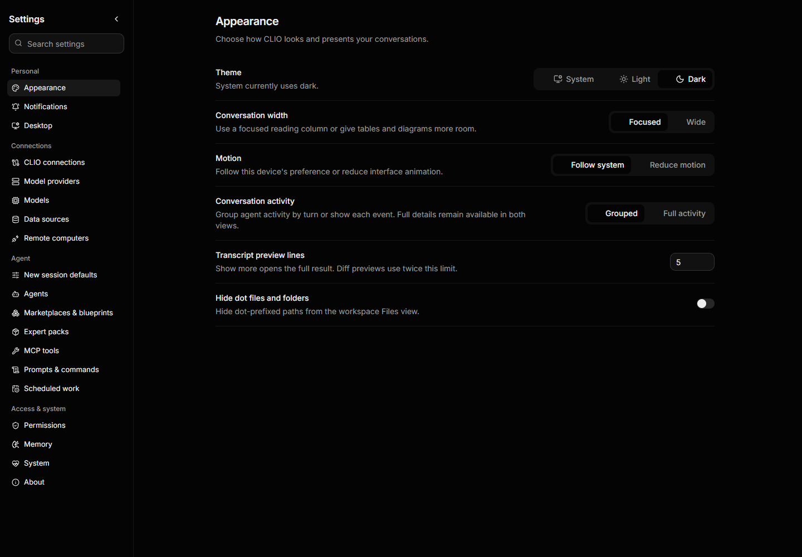
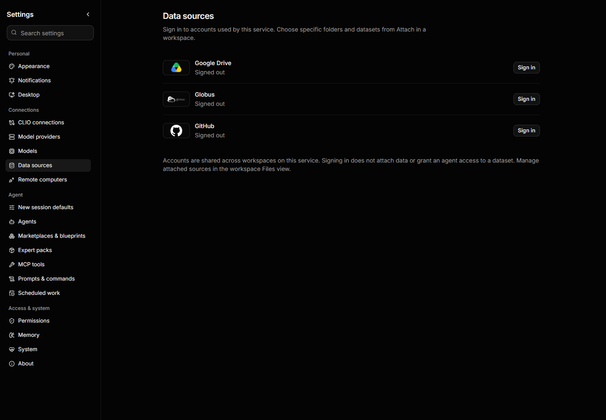
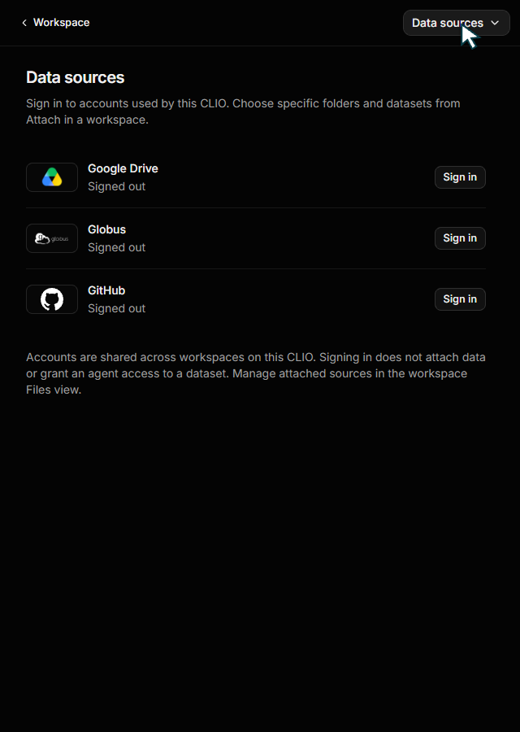
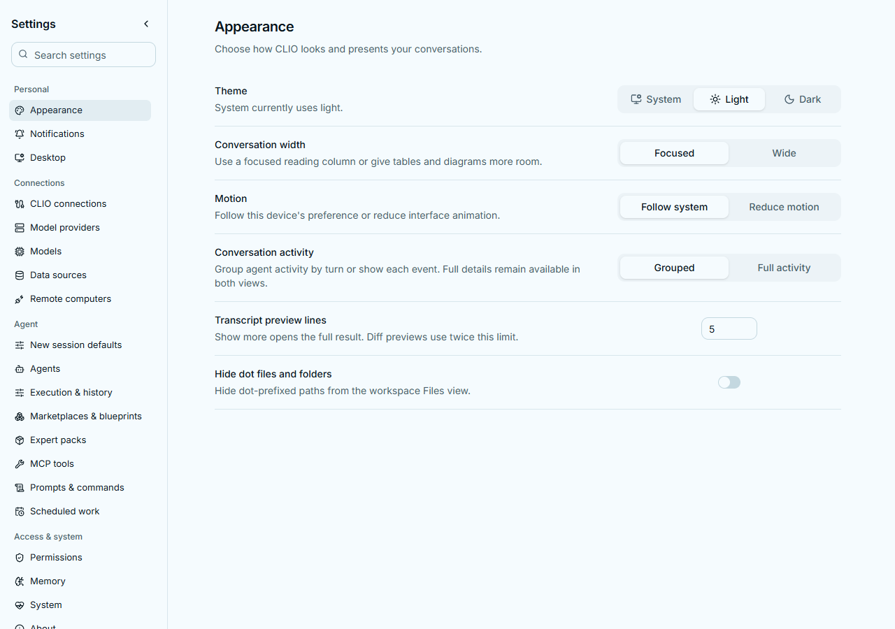
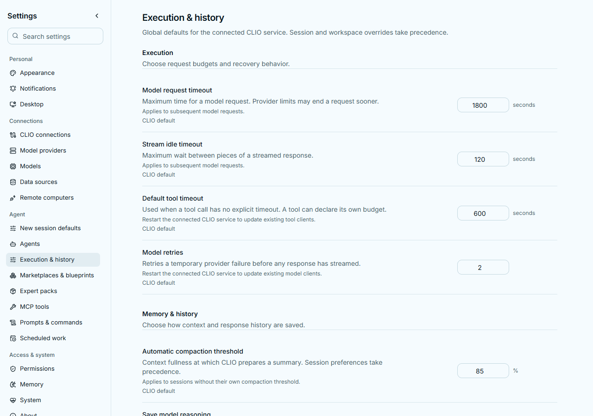

# Settings organization and account scope

Settings uses a searchable sidebar grouped into Personal, Connections, Agent,
and Access & system. All 19 existing destinations remain accessible, with
Execution & history added for global configuration preferences. Each page
scrolls independently of navigation. Narrow windows use a searchable section
menu; Down/Up moves from search to a result, Enter opens it, and Escape closes it.
Navigation keeps the connected service and originating workspace route.

Preference pages use label/description/control rows and compact headings.
Collection pages retain their actual tools, filters, disclosures, actions,
and service-reported details. The settings-only Frame adapter composes the
existing ReUI primitives with flat presentation; other Frame consumers and
registry components keep their styling. The component-reuse guard checks both
the Settings surfaces and their adapter. Product names and action icons use the
existing shared vocabulary.

Preference rows share a 20rem control column and equal-width centred segmented
choices. Each row measures its own available width: below 42rem the description
and control stack, avoiding squeezed descriptions beside the navigation rail.
Hidden radio buttons stay out of layout and theme icons retain their size.

## Global configuration preferences

Execution & history reads and updates `/v1/settings/runtime`. The service owns
the supported-key catalog, validation, descriptions and change-effect labels;
the browser renders that catalog instead of maintaining another set of defaults.

| Control                        | Configuration key              | When it takes effect                 |
| ------------------------------ | ------------------------------ | ------------------------------------ |
| Model request timeout          | `limits.lm_call_s`             | Subsequent model requests            |
| Stream idle timeout            | `limits.lm_inter_token_idle_s` | Subsequent model requests            |
| Default tool timeout           | `tools.mcp.call_timeout_s`     | Restart for existing tool clients    |
| Model retries                  | `limits.lm_transient_retries`  | Restart for existing model clients   |
| Automatic compaction threshold | `autocompact.pct`              | Sessions without their own threshold |
| Save model reasoning           | `runtime.capture_reasoning`    | Subsequent saved responses           |
| Save transcript files          | `transcript.file`              | Service restart                      |

Saving edits only these keys in the connected service's user `config.yaml`, using
the same atomic document owner and lock as model/provider configuration. Other
values, including private provider data, are retained and never returned by this
API. The snapshot identifies workspace, user, environment and packaged-default
sources. Both canonical and legacy workspace overrides are read-only here. A user
file value takes precedence over the environment; Use inherited value removes
that one user override. Transcript files remain required in History mode.

Revisions include the configuration file and effective setting sources. A stale
save returns a conflict and the form retains the draft until the user chooses
Reload current settings. Invalid, unknown and non-finite values are rejected
without writing. Saving never restarts the service automatically.

Model/provider selection and response parameters, session defaults, permission
policies, tools and account connections remain in their existing sections. This
page curates user-facing preferences; it does not expose raw credentials,
internal storage-engine tuning or arbitrary configuration keys.

Data sources in global Settings manages account sign-in and sign-out only.
It reads provider/account status; it never lists or modifies workspace sources.
Sign-in uses the existing private authorization UI without creating a source.
Sign-out retains the existing warning about its effect across workspaces.
Changing the connected service drops the previous private form. Folder and
dataset connection stays in workspace Attach and Files.

Connection health stays visible. Exact missing-feature reasons are available
under Unavailable features instead of forming a long warning above the controls.

## Review

Reviewed all 19 destinations against an isolated live CLIO service at 1440 x
1000, including System tabs and Marketplaces. Checked light/dark appearance,
search/empty/clear states, GitHub private form and back navigation, and the
640 x 900 section menu with keyboard search and account rows. Browser review
opened Attach without adding a source or changing account credentials.
Focused local tests ran individually for account/source separation, destination
search, narrow-menu keyboard navigation, segmented choices, and saving session
defaults. Lint and production online/offline builds passed. Full suites run in CI.

The alignment/configuration follow-up was reviewed against an isolated real
service at 1280, 768 and 390px, in light and dark themes. Appearance,
Notifications, session defaults, configuration controls and phone footer actions
were inspected. The real configuration form saved a 75-second request budget,
then removed that override and restored the original inherited 1800 seconds.
All original captures, rejected setup runs, review scripts and verified hashes
are archived in `D:/Libraries/Videos/clio_recordings/2026-10-06-settings-review`.
Five backend behaviors and three form behaviors ran individually; keyboard
choices and the single focused browser geometry case passed. Scoped lint/type
checks, frontend ownership/branding guards and online/offline builds passed.

