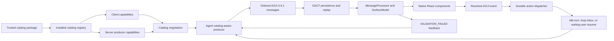

# Campaign: Make CLIO an A2UI 0.9.1-Compatible Agent and Renderer

**Status:** PROPOSED — owner-directed campaign, 2026-08-30  
**Target protocol:** A2UI `0.9.1` (wire spelling `v0.9.1`) over GACT `0.3`  
**Primary repositories:** `clio-agent`, `gact-tui`, `clio-schemas`, and
`clio-agent-marketplace`  
**Compatibility boundary:** installed, negotiated, trusted catalogs; no
executable code is accepted from the wire  
**Keep this document current:** every phase records its issue/PR links, exact
repository SHAs, red baseline, qualification evidence, and remaining failures.

## Campaign goal

CLIO already uses the official A2UI React and web-core packages and processes
the four A2UI 0.9.1 surface operations. That is a real A2UI foundation, but it
is not yet enough to make a broad compatibility claim. The current system is
built around one hard-coded CLIO catalog, a closed hand-maintained action list,
and an action route that treats `form.submit` as an acknowledgement rather than
structured input for the agent. It also rejects client-side function calls,
does not negotiate catalog support, and does not return renderer validation
errors to the producer through the protocol feedback loop.

This campaign turns that partial integration into a complete, testable A2UI
0.9.1 implementation. At completion, a separately packaged trusted catalog can
be installed, advertised, selected by an agent, rendered by CLIO, updated and
replayed, and used to send structured user input back to the owning agent. The
same path must work when the session is idle, actively running, or waiting for
the user. CLIO's existing message queue and wait/resume machinery remain the
owners of agent execution; A2UI becomes another typed source of user input, not
a competing turn runner.

The campaign is complete only when CLIO can truthfully publish this claim:

> CLIO supports A2UI 0.9.1 for negotiated, installed, trusted catalogs,
> including the official surface lifecycle, progressive rendering, local data
> binding, client-side functions, structured agent events, optional full data
> model synchronization, validation feedback, persistence, replay, and custom
> catalog registration.

CLIO must not claim that it can execute arbitrary component code supplied by a
remote agent, that every A2UI catalog works without its renderer implementation
being installed, that it implements A2UI 1.0 RPC semantics, or that MCP Apps are
part of the A2UI path.

## Why the current implementation is not the final claim

The current implementation has substantial protocol-real work worth
preserving:

- The web application pins `@a2ui/react@0.10.2` and
  `@a2ui/web_core@0.10.6` and uses the versioned `v0_9` exports.
- The renderer builds a real `MessageProcessor`, resolves a `SurfaceModel`, and
  renders it through the official React surface component.
- GACT persists ordered `createSurface`, `updateComponents`,
  `updateDataModel`, and `deleteSurface` messages and projects surface state
  through scoped `a2ui.surface.*` events.
- The CLIO catalog contains useful native and scientific components rather
  than raw HTML or executable payloads.
- Client actions use the official `action` envelope with `name`, `surfaceId`,
  `sourceComponentId`, `timestamp`, and resolved `context`.

The remaining gaps are architectural, not cosmetic:

1. `createSurface.catalogId` is accepted only when it equals the single CLIO
   catalog constant. The client also constructs `MessageProcessor` with only
   that catalog.
2. GACT capabilities advertise an A2UI version but not the client's
   `supportedCatalogIds`, inline-catalog policy, or the server's producible
   catalogs.
3. Component and action vocabularies are generated as one closed global union,
   instead of being resolved from the selected catalog.
4. The server rejects `functionCall`, even though catalog-registered local
   functions and validation checks are part of A2UI 0.9.1.
5. The renderer contains a global `LOCAL_ACTIONS` allowlist and sends every
   other action to one generic route. Action ownership belongs to the selected
   catalog and surface, not a global string switch.
6. `form.submit` currently validates and acknowledges fields but does not make
   them available to the agent. `agent.submit` starts a turn only after reducing
   input to `context.text` or `context.prompt`, and rejects a running session
   despite CLIO already having `enqueue_user_steer` and `loop_inbox` semantics.
7. Correlation supplied by the client is not preserved through a complete,
   durable action lifecycle.
8. `sendDataModel: true` is accepted syntactically but the complete current
   surface data model is not carried as A2UI client metadata to the owning
   agent.
9. Renderer validation failures are displayed locally but are not returned as
   official `VALIDATION_FAILED` messages so the producer can repair its output.
10. A live server update can rebuild the message processor from persisted
    messages without a proven rule for retaining unsubmitted local form state.

Closing one named action or adding another CLIO component does not close these
gaps. The campaign changes the ownership model so catalogs, actions, and
renderers are extensible by construction.

## Protocol authority and claim rules

The implementation is governed by the official A2UI 0.9.1 specification and
guides:

- [A2UI 0.9.1 protocol](https://a2ui.org/specification/v0.9.1-a2ui/)
- [Actions and form submission](https://a2ui.org/concepts/actions/)
- [Catalog negotiation](https://a2ui.org/concepts/catalogs/)
- [Defining a custom catalog](https://a2ui.org/guides/defining-your-own-catalog/)
- [Authoring custom components](https://a2ui.org/guides/authoring-components/)
- [Renderer implementation checklist](https://a2ui.org/guides/renderer-development/)
- [Client setup](https://a2ui.org/guides/client-setup/)

The following distinctions are binding:

- `form.submit` and `agent.submit` are CLIO conventions, not protocol-defined
  A2UI action names. A2UI defines generic events with stable names and resolved
  structured context. Catalogs may define domain names such as
  `earthscope.stations.submit`.
- A2UI functions are registered local renderer operations. They do not notify
  the agent and cannot execute arbitrary code received from a producer.
- A catalog ID is a negotiated identifier. Its URI shape does not imply runtime
  fetching. Schema and renderer implementations must already be installed or
  provided by an explicitly trusted development mechanism.
- `sendDataModel` adds the complete current surface data model to transport
  metadata. An action's `context` remains the preferred, minimal, resolved view
  for an explicit button event.
- A2UI 0.9.1 defines event dispatch but does not standardize how an
  orchestrator turns that event into an LLM turn. CLIO's queue, waiting-user
  correlation, and typed lifecycle are transport/orchestration extensions and
  must preserve the official action envelope rather than replace it.
- A2UI 1.0 candidate RPC calls and responses are out of scope for the 0.9.1
  claim. The architecture must leave room for them without pretending they are
  already implemented.

## Owner decisions

These decisions are resolved for the campaign and should not be reopened during
implementation unless protocol evidence proves one impossible.

1. **Target A2UI 0.9.1 first.** Keep versioned boundaries so 1.0 can be added
   later; do not mix 1.0 RPC messages into the 0.9.1 wire.
2. **The CLIO workspace catalog becomes one package in a registry.** It is no
   longer a global special case, although it remains installed by default.
3. **Catalog packages are reuse-first.** Their React implementations should
   wrap or directly compose AI Elements, ReUI, shadcn, and other selected
   professional components rather than imitate them by hand.
4. **External catalogs are installable, not remotely executable.** A trusted
   package supplies its schema, renderer implementations, functions, action
   policy, producer guidance, examples, and tests. A wire `catalogId` selects an
   installed package; it never imports JavaScript, CSS, HTML, or commands.
5. **Inline catalogs are disabled in production by default.** A development
   setting may accept declarative inline schemas only. Inline schema receipt
   never installs a renderer implementation or broadens permissions.
6. **Actions remain structured.** The complete resolved context is the
   authoritative agent input. A readable text narration may be derived for a
   model, but it cannot replace or discard the typed payload.
7. **There is no separate A2UI turn runner.** Idle actions may start a turn,
   actions received during a running turn use the existing queued-steer path,
   and actions correlated to `waiting_user` resume that wait.
8. **Action names are domain events.** Generic aliases may remain for migration,
   but new workflows use catalog-declared names such as
   `earthscope.stations.submit`, `approval.respond`, or `run.cancel`.
9. **The user chooses scientifically meaningful candidates.** An EarthScope
   workflow does not silently pick the nearest station when several valid
   candidates exist unless the request explicitly asks for nearest or provides
   an unambiguous station ID.
10. **The agent decides when a visual helps.** Domain skills explain available
    A2UI affordances and usage; normal user prompts do not contain component
    IDs, action envelopes, artifact URIs, or instructions to call A2UI tools.
11. **Catalog state is surface-scoped.** Local form state survives unrelated
    server updates and is cleared or reconciled only by an explicit surface
    update, deletion, accepted action policy, or authoritative snapshot.
12. **No compatibility claim rests on screenshots alone.** Acceptance combines
    schema/conformance coverage with a real browser and Tauri interaction
    observed against clean backend state.

## Target architecture



### Catalog registry

Both client and server consume a shared catalog manifest. The manifest is CLIO
packaging metadata around the official A2UI catalog schema; fields marked
`x_clio_*` are CLIO extensions and must not be misrepresented as protocol
fields.

```ts
interface InstalledA2UICatalogManifest {
  catalog_id: string;
  protocol_versions: ["0.9.1", ...string[]];
  schema_ref: string;
  renderer_entry: string;
  producer_guide_ref: string;
  trust: {
    source: "bundled" | "marketplace" | "administrator" | "development";
    package_id: string;
    package_version: string;
    integrity: string;
  };
  x_clio_actions: Record<string, {
    context_schema_ref: string;
    destination: "local" | "agent" | "approval" | "run";
    permission?: string;
    delivery: "immediate" | "queue_or_start" | "resume_correlated_wait";
    coalesce_key?: string;
  }>;
}
```

The official catalog JSON Schema continues to define components, functions,
and theme properties. The CLIO manifest adds packaging, trust, action routing,
and producer documentation. Schema generation creates server validators and
frontend types per catalog; it must not collapse all installed catalogs into
one manually edited global union.

The registry exposes, at minimum:

- installed catalog IDs and versions;
- protocol versions supported by each catalog;
- whether the renderer implementation is present and loadable;
- whether the producer schema and guidance are present;
- package source, integrity, and health/degradation reason;
- components, functions, and agent-event names declared by the catalog; and
- production/development eligibility.

### Capability negotiation

`GET /v1/capabilities` and the initial GACT handshake gain an A2UI capability
record that can represent both sides honestly:

```ts
interface A2UICapabilities {
  protocol_versions: string[];
  supported_catalog_ids: string[];
  producible_catalog_ids: string[];
  inline_catalogs: "disabled" | "schema-only-development";
  client_functions: boolean;
  send_data_model: boolean;
  validation_feedback: boolean;
  replay: boolean;
  degradations: Array<{ code: string; detail: string; catalog_id?: string }>;
}
```

The browser and Tauri transports carry the same client capability set. Before
creating a surface, the server selects a catalog in the intersection of the
client's supported IDs, the server's producible IDs, and the session's trusted
catalog policy. If no compatible catalog exists, the agent continues without a
surface and a typed degradation explains why. It never sends an unsupported
catalog and hopes the UI ignores it.

### Renderer and protocol core

CLIO continues to rely on `@a2ui/web_core/v0_9` for message processing, surface
state, bindings, templates, and function evaluation. The CLIO layer owns:

- selection of the installed catalog by `createSurface.catalogId`;
- mapping catalog component implementations to the CLIO design system;
- forwarding official agent events with resolved paths;
- executing only registered local functions;
- emitting official client error messages;
- carrying capability and data-model metadata through GACT; and
- mounting surfaces inside the conversation and workspace canvas without
  inventing a second protocol projection.

The implementation must exercise the complete 0.9.1 renderer checklist:

- `createSurface`, `updateComponents`, `updateDataModel`, and `deleteSurface`;
- progressive rendering once a valid `root` exists;
- fixed catalog identity for a surface's lifetime;
- flat adjacency-list reconstruction and dynamic child templates;
- two-way local binding for inputs;
- synchronous context path resolution at action time;
- registered catalog functions and checks;
- full data-model metadata when `sendDataModel` is true;
- structured `VALIDATION_FAILED` messages; and
- deletion of all surface-local components and data.

### Durable structured action pipeline

An action must remain recognizable as the exact user interaction that occurred.
The persisted record is richer than the minimum official envelope but contains
that envelope without rewriting it:

```ts
interface ClioA2UIActionRecord {
  id: string;
  protocol_version: "0.9.1";
  action: {
    name: string;
    surfaceId: string;
    sourceComponentId: string;
    timestamp: string;
    context: Record<string, unknown>;
  };
  client_data_model?: { surfaces: Record<string, unknown> };
  correlation: {
    connection_id: string;
    workspace_id: string;
    session_id: string;
    run_id?: string;
    message_id?: string;
    part_id?: string;
    question_id?: string;
  };
  catalog_id: string;
  surface_revision: number;
  idempotency_key: string;
  state: "received" | "validated" | "queued" | "delivered" |
    "resolved" | "rejected" | "failed";
  result?: Record<string, unknown>;
  error?: { code: string; message: string; recoverable: boolean };
}
```

The dispatcher selects one execution path after validating catalog, surface,
revision, component, action, context schema, permissions, and correlation:

| Session state | Delivery behavior | User-visible result |
| --- | --- | --- |
| Idle | Start one correlated agent turn with the structured action attached to the user input. | `accepted`, then `running` |
| Running | Use `enqueue_user_steer`; deliver at the next safe tool boundary or re-drive exactly once if the active turn ends first. | `queued`, never `409 session_busy` |
| Waiting for the correlated user response | Resolve that wait with the structured action and resume its owning run. | `resuming` |
| Waiting for an unrelated response | Queue deliberately or reject with a typed correlation error according to the action manifest. | `queued` or typed rejection |
| Completed but retryable run action | Invoke the registered run mutation with authorization and idempotency. | mutation lifecycle |
| Deleted/stale surface or revision | Reject without invoking the agent. | typed stale-surface error |
| Duplicate idempotency key | Return the existing action record and do not deliver twice. | previous lifecycle state |

The model receives both a machine-readable action attachment and a concise
derived narration. For example, the narration may say “The user selected GNSS
stations MTA1 and PKRD from the station map,” while the structured record keeps
the exact IDs, search identifier, catalog ID, surface revision, and component
source. Providers that support typed input receive it directly; providers that
require text still receive the structured object in turn metadata so the text
projection is not the only source of truth.

### Validation feedback

Renderer failures are part of the agent feedback loop, not just a red card in
the browser. Invalid A2UI output produces a client-to-server error containing:

```json
{
  "version": "v0.9.1",
  "error": {
    "code": "VALIDATION_FAILED",
    "surfaceId": "earthscope-stations",
    "path": "/components/3/action/event/context/stationIds",
    "message": "Expected a data-model path binding for stationIds."
  }
}
```

The server persists the failure, correlates it to the producing message/part,
and exposes it to the agent for a bounded repair attempt. Repeated invalid
output terminates with a typed failed surface rather than looping. Validation
details stay available in trace/inspector views without overwhelming the main
conversation.

## Principal acceptance scenario: human-directed EarthScope station analysis

This scenario proves the feature users actually need rather than a synthetic
button acknowledgement.

### User interaction

The human asks naturally:

> Show me the GNSS stations around Lake Tahoe.

The EarthScope skill grounds the place and discovers stations. If multiple
scientifically meaningful candidates exist, the agent says, in normal prose:

> I found five stations around Lake Tahoe and plotted them below. Select one or
> more and I can analyze their position data.

The agent creates a stage-specific map surface. It does not choose one station
on the user's behalf. The map uses a bound multiple-selection model:

```json
{
  "searchId": "earthscope-search-01",
  "stations": [
    {"id": "P123", "name": "P123", "latitude": 39.1, "longitude": -120.0},
    {"id": "P456", "name": "P456", "latitude": 39.2, "longitude": -120.1}
  ],
  "selectedStationIds": []
}
```

Selecting map markers updates `/selectedStationIds` locally. The submit button
dispatches a catalog-declared event rather than a hard-coded generic form:

```json
{
  "version": "v0.9.1",
  "action": {
    "name": "earthscope.stations.submit",
    "surfaceId": "earthscope-stations",
    "sourceComponentId": "analyze-selection",
    "timestamp": "2026-08-30T18:00:00Z",
    "context": {
      "searchId": "earthscope-search-01",
      "stationIds": ["P123", "P456"]
    }
  }
}
```

The backend validates that the station IDs came from the current surface and
search result, preserves the structured action, and delivers it through the
idle/queued/resume path appropriate to the session. The agent then stages and
analyzes only the selected stations. Surface updates communicate `queued`,
`analyzing`, `completed`, or a typed per-station failure without erasing the
selection history.

### Scenario acceptance

The scenario passes only if all of the following are observed in a clean live
session:

- the user's prompt contains no A2UI vocabulary or component instructions;
- the skill suggests the map because it helps the scientific decision;
- the agent emits a valid surface using a negotiated installed catalog;
- selecting one and multiple markers updates the local data model immediately;
- validation prevents submission with no selection;
- the action contains exact selected IDs, not a prose-only summary;
- the action is visible in causal position in Full mode and summarized once in
  Chain mode;
- an idle session starts one turn;
- a running session queues the same action without a conflict;
- a correlated waiting-user operation resumes rather than starting an unrelated
  turn;
- reconnect before and after submission does not lose selection or duplicate
  delivery;
- the agent's next work uses exactly the selected stations; and
- browser and Tauri render and behave identically.

## Cross-repository work products

### `clio-schemas`

- Versioned A2UI 0.9.1 envelope, capability, client data model, error, action,
  catalog-manifest, and durable action-record schemas.
- Catalog schema packaging that composes the official common types without
  hard-coding the CLIO catalog as the universal component union.
- Deterministic generation for Python and TypeScript consumers.
- Compatibility fixtures derived from official examples plus CLIO extension
  cases.

### `clio-agent`

- Installed catalog registry and capability negotiation.
- Catalog-aware producer tools for create, component update, data update, and
  deletion; tools choose among negotiated catalogs instead of inserting a
  constant.
- Durable structured action store, validation, idempotency, and causal audit
  events.
- Delivery adapters for idle turns, `enqueue_user_steer`, and correlated
  waiting-user resume.
- `sendDataModel` ingestion with surface ownership filtering.
- `VALIDATION_FAILED` feedback and bounded producer repair.
- Agent/skill-facing catalog documentation generated from installed manifests.

### `gact-tui`

- DOM-free capability, catalog, action, error, and lifecycle types in core.
- Runtime catalog registry and lazy renderer loading in React.
- Client capability advertisement in browser and Tauri transport paths.
- Official registered local-function/check execution; removal of the global
  hand-written local-action switch.
- Preservation of unsubmitted local state across live updates and reconnect.
- Structured error return, action lifecycle feedback, focus/accessibility, and
  responsive rendering.
- One visual language for native and A2UI maps, plots, tables, artifacts,
  forms, waiting states, and completion.

### `clio-agent-marketplace`

- Catalog packages install with their marketplace content and expose health in
  the infrastructure/settings UI.
- EarthScope skills describe when maps, selection, tables, and interactive
  time-series views help; they do not force one end-of-turn dashboard or expose
  protocol syntax to the user.
- A separate compatibility-proof catalog independent from the CLIO workspace
  catalog.
- Upgrade/reload behavior that makes a new catalog revision available without
  uninstall/reinstall when the package manager can safely reload it.

## Campaign phases

The phases are an execution sequence with entry and exit gates. They are not a
backlog ordered by perceived importance; no later phase can compensate for an
earlier incomplete protocol boundary.

## Phase 0 — Freeze the claim and establish the red baseline

Create one umbrella issue per affected repository and one fully specified issue
per workstream in this document. Open draft PRs before feature changes so every
commit enters CI. Record current package versions, branch SHAs, protocol
fixtures, existing live surfaces, and the failures for each compatibility row.

Add a machine-readable claim matrix under `docs/qualification/a2ui-v091/` with
one row per requirement and `unverified`, `failing`, or `passing` evidence. The
initial state must explicitly show the fixed-catalog, missing-function,
structured-submit, queue, data-model, error-feedback, and external-catalog
failures. Existing successful lifecycle evidence remains recorded; the campaign
does not erase work that is already real.

**Exit gate:** issue/PR set exists, first CI results are recorded, an official
example corpus fails in the expected places, and no public documentation makes
the final compatibility claim.

## Phase 1 — Put the protocol and catalog registry in shared schemas

Introduce versioned schema owners for:

- official server-to-client and client-to-server 0.9.1 messages;
- client and server A2UI capability metadata;
- catalog manifests and installed-catalog health;
- client data-model metadata;
- validation errors;
- durable CLIO action records and correlation extensions; and
- per-catalog component and action-schema generation.

Refactor the GACT normative contract so `catalogId` is not fixed to one value.
Keep the CLIO workspace catalog as the required default installed catalog and
document the exact trust boundary. Generated types replace manual duplicated
action/component definitions in both repositories.

**Exit gate:** Python and TypeScript generate byte-stable definitions from the
same sources; two distinct catalog IDs validate; an unknown or uninstalled
catalog fails with a typed reason; and the old one-catalog assumption is absent
from normative schemas.

## Phase 2 — Negotiate and load installed catalogs

Build the server and client registries and expose catalog health through
capabilities. The React renderer chooses an implementation by the surface's
catalog ID and constructs `MessageProcessor` with the complete supported
registry. Browser and Tauri advertise the same IDs. The server produces only
from the negotiated intersection.

Marketplace installation registers every catalog package it contains. Default
CLIO installation registers the CLIO workspace catalog and the general bundled
marketplace catalogs. Development reload updates schema and renderer entries
atomically or leaves the previous healthy revision active with a typed failure.

**Exit gate:** installing the compatibility-proof package adds a catalog to
capabilities and allows a surface to render without editing CLIO core source;
removing or disabling it removes the capability and causes safe degradation;
catalog version mismatch is visible and never silently coerced.

## Phase 3 — Complete renderer semantics

Exercise the official `web_core` path rather than implementing parallel CLIO
state. Add catalog-registered functions and checks, full data-model metadata,
client validation feedback, dynamic lists, progressive rendering, and stable
surface-local form state. Replace global action-name classification with
catalog and component ownership.

Each catalog component uses an existing professional component where suitable.
Scientific components preserve the same interaction quality as their native
counterparts: map selection, data-grid selection/filtering, drag-to-focus plots,
artifact canvas opening, keyboard/touch parity, and reduced motion.

**Exit gate:** the official 0.9.1 renderer checklist passes for the Basic
compatibility catalog and the CLIO catalog; a registered local function executes
without a network request; a resolved event includes current bound values; a
validation error returns to the producer; and a server update does not wipe
unsubmitted input.

## Phase 4 — Deliver structured actions to the owning agent

Replace the `agent.submit`/`form.submit` route fork with a durable catalog-aware
dispatcher. Keep migration aliases only long enough to update existing
surfaces. Wire the dispatcher into existing turn and wait owners:

- idle → start one correlated turn;
- running → `enqueue_user_steer` and `loop_inbox`;
- waiting user → resolve the correlated wait;
- approval/run mutations → their typed owners; and
- stale, unauthorized, duplicate, or invalid → typed terminal result.

Persist the official envelope, client data model when requested, correlation,
catalog/revision identity, lifecycle, and result. Publish scoped events so the
UI shows received/queued/delivered/resolved state without inventing progress.

**Exit gate:** the same structured selection action succeeds idle, queued, and
waiting-user paths; duplicate submission is idempotent; the agent receives the
exact object; and no running-session action returns the current false
`session_busy` conflict.

## Phase 5 — Make agents fluent producers without burdening users

Generate producer documentation and examples from installed catalog manifests.
Agent tools support all four surface operations and data-only updates/deletion,
not only one create-with-components helper. Repair feedback is bounded and
specific.

Update the EarthScope skills so visual affordances are suggestions tied to the
scientific stage:

- discovery may show selectable stations on a map;
- comparison may show a table and map when useful;
- time-series analysis may show an interactive data-backed plot;
- files remain artifacts/canvas tabs rather than duplicate static images inside
  a plot surface; and
- no skill emits a forced monolithic dashboard after all work is complete.

The agent may delegate independent work when useful. Delegation and tool calls
remain visible in causal position; A2UI does not flatten or rewrite the agent
transcript.

**Exit gate:** a clean natural-language EarthScope session creates valid
stage-specific views without A2UI instructions in the user prompt, accepts a
structured selection, and continues from that selection. Invalid generation is
repaired or fails visibly, never printed as JSON chat content.

## Phase 6 — Prove persistence, replay, security, and native parity

Make action and surface state survive refresh, cursor reconnect, gap
reconciliation, desktop sleep/wake, and backend restart. Define which local
unsubmitted values are session-memory-only and how the user is warned before a
destructive surface replacement.

Run the security corpus against:

- unknown catalogs, components, functions, actions, and bindings;
- raw HTML, CSS, imports, executable URLs, scripts, commands, and event
  handlers;
- oversized component graphs, data models, contexts, images, and update rates;
- cross-session and cross-surface IDs;
- stale revisions and replayed actions;
- malicious inline catalogs;
- permission-gated agent/run actions; and
- multi-agent data-model leakage.

Full data-model metadata is filtered to surfaces owned by the recipient. A
subagent cannot inspect another agent's surface data merely because the client
sent `sendDataModel` metadata.

**Exit gate:** browser and Tauri pass identical lifecycle/action cases; replay
does not duplicate work; local state rules are observable; every malicious case
is rejected or contained with a typed reason; and no executable content crosses
the trusted catalog boundary.

## Phase 7 — Independent catalog and live compatibility qualification

Create a small compatibility catalog owned outside the CLIO catalog module. It
must include:

- a container and leaf components;
- a bound text field or choice picker;
- one registered local function/check;
- one structured agent event;
- `sendDataModel: true` coverage;
- progressive component and data updates; and
- surface deletion.

Install it through the same package mechanism offered to external developers.
Do not add an import or switch case to `a2ui-catalog.tsx`, `a2ui-surface.tsx`, or
the action route for the proof. Run its official message corpus in the browser
and Tauri, submit its form while idle and running, reconnect, and delete it.

Then run the complete EarthScope station-selection scenario with real tools and
clean workspace state. Record video/screenshots for human review, but bind them
to exported action/surface records, network frames, and exact SHAs.

**Exit gate:** the independent package works without core edits; the EarthScope
scenario passes; all required CI is green with no inappropriate skips or
ratchet raises; accessibility and performance gates pass; and an exact-head
review confirms the compatibility matrix.

## Phase 8 — Publish the bounded compatibility claim

Update public documentation with:

- exact A2UI protocol and SDK versions;
- the supported installed-catalog model;
- catalog authoring, packaging, trust, and reload instructions;
- action delivery semantics for idle/running/waiting sessions;
- security limits and unsupported executable content;
- migration guidance from CLIO's legacy generic actions;
- the compatibility matrix and qualification report; and
- explicit A2UI 1.0 and MCP Apps non-claims.

Remove compatibility-only constants, obsolete fixed-catalog validation, global
action allowlists, dead aliases after migration, and duplicated hand-maintained
schemas. Release notes link the exact paired repository SHAs and catalog package
versions.

**Exit gate:** documentation and runtime capabilities make the same bounded
claim; a new catalog author can reproduce the independent proof from a clean
checkout; and no page says merely “A2UI compatible” without the version and
installed trusted-catalog boundary.

## Compatibility qualification matrix

Each row requires automated evidence and at least one live observation where
noted. “Implemented” without linked evidence remains unverified.

| Contract | Required proof |
| --- | --- |
| Version negotiation | Client and server agree on `0.9.1`; unsupported versions fail before surface creation. |
| Catalog negotiation | Two installed catalogs advertise and render; unknown/mismatched IDs degrade safely. |
| `createSurface` | Unique surface, fixed catalog, theme, and `sendDataModel` retained. |
| `updateComponents` | Progressive flat updates render with forward references/placeholders and bounded structure. |
| `updateDataModel` | Root and path updates, deletion semantics, bindings, and dynamic lists react correctly. |
| `deleteSurface` | Components, data, local state, and renderer resources are released; replay retains a terminal tombstone. |
| Inputs and local model | Text, checkbox, choice, and slider writes are synchronous and action context sees the latest values. |
| Client functions/checks | Registered functions run locally; checks disable invalid submission; unknown calls fail closed. |
| Agent events | Official action envelope preserves exact resolved structured context and source identity. |
| Full data model | `sendDataModel` includes only authorized surface state in client metadata. |
| Error feedback | `VALIDATION_FAILED` reaches the producer with surface, JSON path, and concise reason. |
| Action lifecycle | Received, queued, delivered, resolved/rejected states are durable, scoped, causal, and idempotent. |
| Busy session | Existing queue accepts structured A2UI input and delivers it once at the correct boundary. |
| Waiting user | Correlated form/selection resumes the intended operation rather than starting an unrelated turn. |
| Persistence/replay | Refresh, cursor resume, gap recovery, and backend restart converge without duplicate actions. |
| Accessibility | Keyboard, focus, touch, labels, errors, reduced motion, and responsive canvas behavior pass. |
| Performance | Dense tables/maps/plots and high-rate updates stay responsive; offscreen surfaces suspend expensive work. |
| Security | Untrusted code/content, cross-surface access, oversize payloads, and unauthorized actions fail closed. |
| External catalog | A separately packaged catalog installs and works without a CLIO core source edit. |
| EarthScope selection | Human selects one or more real stations and the agent analyzes exactly that structured selection. |

## Required test and acceptance corpus

### Schema and protocol

- Official example streams for lifecycle, form submission, data synchronization,
  functions, and validation errors.
- Message ordering, duplicate create, update-before-create, delete-before/after
  update, and recreate rules.
- JSON Pointer resolution, root replacement, key deletion, type conversion,
  dynamic templates, and missing paths.
- Per-catalog schema selection and major-version mismatch.
- Capability intersection and typed no-match degradation.

### Action delivery

- Context path values resolve after the last synchronous input write.
- Empty or invalid selections are blocked locally and revalidated server-side.
- Idle, running, waiting-user, cancelled, completed, and disconnected session
  cases.
- Two rapid clicks and reconnect retry deliver one action.
- Correlation remains attached across queue, turn, tool, artifact, and surface
  updates.
- `form.submit` migration preserves all fields; no structured field disappears
  into an acknowledgement.
- Generic `agent.submit` migration accepts structured context instead of
  requiring a hand-authored text prompt.

### Renderer and interaction

- React Testing Library and user-event coverage for every Basic input/action
  component and each CLIO scientific component.
- Axe coverage for generated labels, invalid input, modal focus, dynamic
  updates, and action status.
- Playwright coverage for progressive streaming, selection, submit, queued
  status, agent response, reconnect, deletion, light/dark, reduced motion,
  tablet/mobile, and resizable/fullscreen canvas.
- Performance traces for a 1,000-row table, 500-point map, 100,000-point
  data-backed plot, and sustained `updateDataModel` stream. No interaction may
  become unusably slow while hidden surfaces continue rendering.

### Live scientific acceptance

- Clean disposable backend state and workspace; no old session artifacts are
  accepted as current evidence.
- Real provider selection visible in the UI and confirmed by turn provenance.
- Real EarthScope geocoding/station tools and observed station identifiers.
- Map selection of one and multiple stations followed by structured submit.
- Data staging and interactive time-series view only after user selection.
- Source-time limitations disclosed from tool evidence rather than fabricated
  recency.
- Browser refresh during selection and during agent work.
- The same run through native Tauri using the supervisor-discovered endpoint.

## Performance and UX acceptance

A protocol-complete surface that is unpleasant to use is not product-complete.
Every live checkpoint inspects the actual rendered interface, including hover,
focus, keyboard, touch, dense data, resizing, and motion. Tests are evidence of
contract stability, not a substitute for interaction review.

Generated UI follows the CLIO composition rules:

- no dot-only status or color-only meaning;
- no nested border stack merely because protocol nodes are nested;
- no duplicate static artifact below an interactive plot; expose the fallback
  artifact through a compact action or canvas tab;
- no monolithic A2UI payload forced to the end of a turn when stage-specific
  views answer the user's question earlier;
- no raw tool/action names when a catalog supplies a clean presentation name;
- critical actions remain visible to keyboard/touch users;
- streaming updates retain stable geometry and frame-batched rendering; and
- an A2UI surface opens in the conversation or durable canvas according to the
  same click/Shift-click contract as native artifacts and child sessions.

## Security and trust model

Compatibility does not mean executing arbitrary remote UI code. Catalog
installation is an administrative/package operation. The producer can send
only declarative messages validated against a negotiated installed schema.

The trust model has four layers:

1. **Package trust:** origin, version, integrity, and administrator policy decide
   whether a catalog package may register.
2. **Protocol validation:** every message validates against A2UI 0.9.1 plus the
   selected catalog schema and CLIO limits.
3. **Renderer confinement:** only installed components and functions execute;
   URLs and resources pass allowlists/sanitizers; no HTML/CSS/import/command
   escape exists.
4. **Action authorization:** the catalog manifest describes shape and intended
   destination, but server authorization and correlation decide whether the
   requested agent/run/approval operation is permitted.

Inline schemas in development never cross layer 1 by themselves. They can help
validate ad-hoc declarative output only when matching renderer implementations
are already installed. Production capabilities must report inline catalogs as
disabled unless a later campaign defines a stronger distribution sandbox.

## Migration and removal

Existing CLIO surfaces migrate without fabricating a second protocol:

1. Package `https://iowarp.ai/a2ui/catalogs/clio-workspace/v1` as the bundled
   default catalog using the registry contract.
2. Generate its component, function, and action definitions from the package.
3. Replace the fixed catalog validator and renderer import with registry lookup.
4. Map legacy `form.submit` and `agent.submit` surfaces to structured dispatcher
   policies while their producers are updated to domain event names.
5. Remove the aliases after saved/replay compatibility is no longer required,
   with an explicit versioned migration rather than a silent reinterpretation.
6. Remove global `SERVER_ACTIONS`, `CLIENT_ACTIONS`, the React `LOCAL_ACTIONS`
   set, fixed-catalog capability fields, and any generated universal catalog
   union superseded by per-catalog validation.
7. Update the normative GACT spec and frontend capability ledger so they no
   longer label the old fixed-catalog action acknowledgement as complete A2UI
   action support.

## Evidence record template

Every completed phase appends a record here or links a qualification artifact
containing:

- date/time and operator;
- repository branch, exact head SHA, base SHA, and PR;
- installed A2UI packages and catalog package versions;
- clean-state directory/workspace/session IDs;
- commands and CI links;
- pass/fail/skip counts, with skipped-that-should-run treated as failures;
- browser and Tauri URLs/session identity;
- capability response and negotiated catalog ID;
- surface/action IDs and persisted action lifecycle;
- screenshots/video plus network or exported-record evidence;
- observed performance/accessibility results;
- typed degradations and unresolved failures; and
- reviewer verdict at the exact head.

## Definition of done

This campaign is done only when:

- all nine phases have recorded exit-gate evidence;
- the official A2UI 0.9.1 lifecycle and renderer checklist pass;
- Basic and CLIO catalogs work through the registry;
- an independently packaged catalog installs and works without editing CLIO
  core;
- client and server negotiate catalogs and versions honestly;
- catalog-defined local functions and validation checks work;
- structured events reach the agent through idle, queued, and waiting-user
  paths without data loss;
- `sendDataModel` and `VALIDATION_FAILED` complete their round trips;
- actions and surfaces persist, replay, reconnect, and remain idempotent;
- the EarthScope station-selection scenario succeeds with real data and natural
  user prompts;
- browser and Tauri acceptance pass with usable performance and accessibility;
- the security corpus rejects executable, unauthorized, cross-surface, stale,
  and oversized inputs;
- no required test is failing or inappropriately skipped and no ratchet baseline
  is raised to hide new debt;
- exact repository and catalog SHAs/versions are recorded;
- an exact-head review approves the compatibility matrix; and
- public documentation uses the bounded compatibility wording in this document
  and preserves the explicit A2UI 1.0, arbitrary-code, and MCP Apps non-claims.

Until every condition is satisfied, CLIO may say it has an A2UI 0.9.1-based
renderer and a CLIO catalog integration. It may not claim complete A2UI 0.9.1
compatibility.
