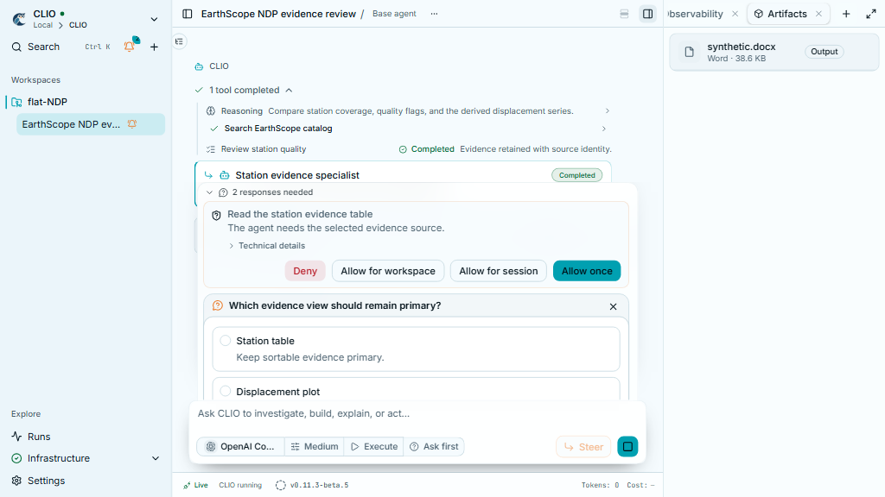
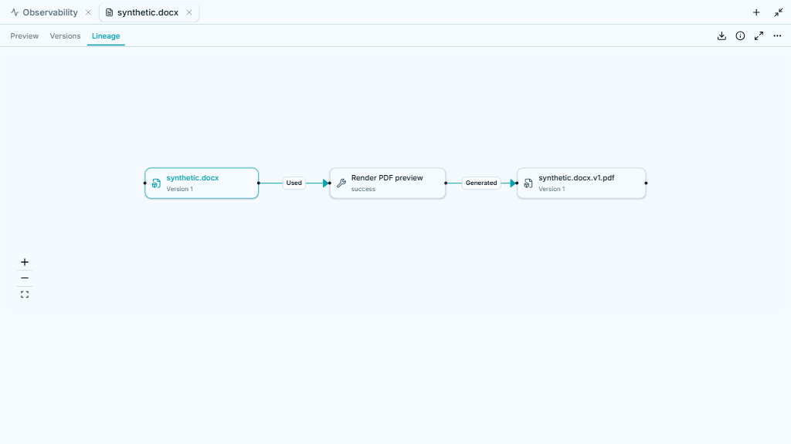

# Document preview semantics (browser fixtures)

These originals show production UI with synthetic DOCX/PDF files and controlled
API transport at 1280 x 720 and 390 x 844. The PDF fixture was previously rendered
by the managed document stack. Session data and the displayed lineage response
are fixtures. These captures prove presentation and interaction, not a fresh
provider turn, a new converter run or native Desktop/Office acceptance.

The deliverables list keeps the DOCX and omits its source-bound preview PDF.
Opening that DOCX displays its saved PDF while Download retains the source name
and exact DOCX bytes. The selected Preview/Versions/Lineage tab has a primary
colour and visible underline, including icon mode. The graph starts at the DOCX
and runs through Render PDF preview to the derivative. Narrow toolbars fit the
canvas. Maximization retains the phone dialog's pointer and focus boundary.

## Validation

Six selected UI behaviours passed sequentially with one worker: preview filtering
and immutable lookup, transcript card filtering, shared zoom, document content,
and canvas maximization/Escape in desktop and sheet containers. The production
route DOCX browser case passed individually at desktop and phone sizes, covering
the filtered inventory, selected-state computed CSS, source download/hash,
saved-preview rendering, forward lineage layout, version navigation and refresh.
The browser case adds phone coverage for Office profiles; other profiles remain
for CI rather than a broad local suite. TypeScript, Oxlint, formatting, six shared
frontend guards and online/offline builds passed. Existing offline PDF import.meta
warnings remain.

Backend tests separately verify source -> conversion -> preview edges, immutable
source/preview downloads after workspace edits, preview reuse, explicit sources,
legacy registration projection and child-delivery filtering. Their converter is
stubbed inside tests. Three captured transcript scenarios matched unchanged
golden files byte for byte; no checksum, event or assertion was altered. Scoped
Ruff, Pyright and file-size/exception guards passed using the managed Python 3.12
environment. Target interpreter qualification remains on CI.

The initial phone overflow and modal-overlay failures are retained as rejected
evidence. Accepted originals, logs, review sources and SHA-256 hashes are archived
in `D:/Libraries/Videos/clio_recordings/2026-10-07-document-preview-semantics`.
The six published PNGs are exact copies of the archived originals. The dark
toolbar crop uses controlled dark CSS in the same browser fixture. Unbound,
separately published PDFs are retained; no filename inference or private-history
migration was performed. User services 8141/5196 and private configurations were
not changed.
