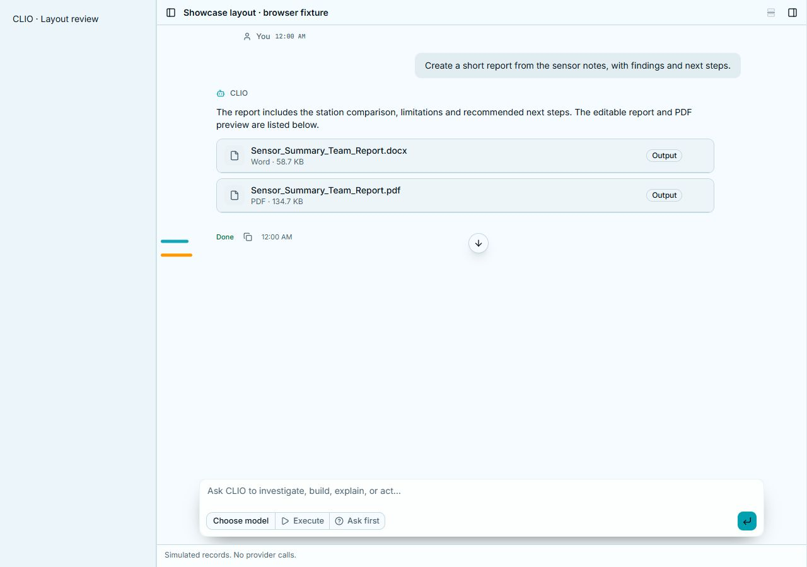
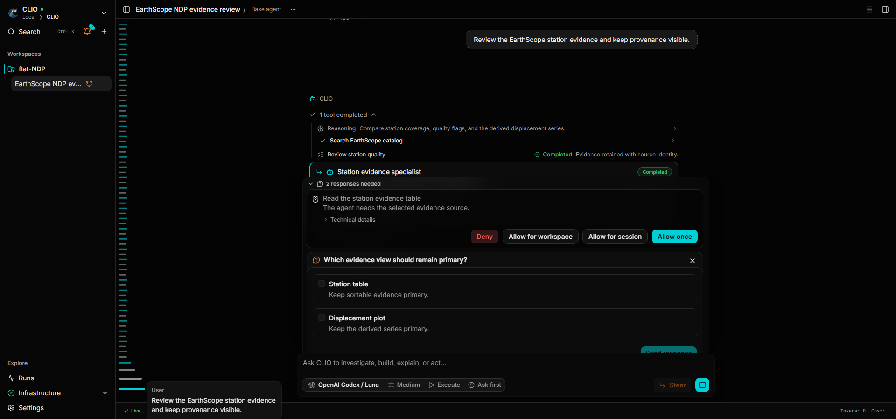
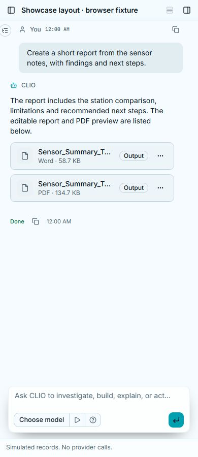

# Transcript landmark sizing

The colored transcript landmarks are slightly thicker at rest (3 px) and expand
to 5 px under the pointer or at the active message. Their length grows only into
the spare left margin, up to 56 px. A wider transcript preference or an open
canvas reduces the available margin; phones keep the existing compact outline.
Hover does not change the transcript column's position or width.

## Captures

- `desktop-landmarks.jpg`: the actual conversation components at 1280 × 900,
  with a 50 px active landmark and a clear gap before the transcript column.
- `wide-hover.png`: the built production route at 1920 × 900, with a 56 px
  hovered landmark and gradual expansion of its neighbors.
- `phone-outline.jpg`: the same conversation components at 390 × 900, retaining
  the compact outline control instead of a wide landmark rail.

All records are browser fixtures, not fresh provider inference. The light
captures come from the explicitly labeled `session-showcase` component fixture;
the dark hover capture comes from the existing stateful workspace E2E fixture.
Screenshots are preserved originals, with no compositing or geometry edits.

## Validation

The individual unit case retains landmark accessibility, distinct transcript
prose, previews and navigation. The focused production-route margin case checks
1280/1920 px layouts, the Wide preference at 1280 px, the compact outline at
390 px, and unchanged transcript geometry on hover. The existing dense workspace
case checks navigation, isolated wheel scrolling, keyboard access, adjacent
landmarks, previews, canvas behavior and accessibility. It passes on Windows and
Linux with one worker, using the same browser build.

The Windows and Linux desktop and mobile workspace snapshots were reviewed and
regenerated for the intentional accumulated composer/activity/toolbar changes
and new marker sizing. Both desktop and mobile cases passed again against the
accepted references on each platform. The existing pixel tolerances are unchanged.
A separate CI query repair
scopes the visible `Settled` badge to the evidence button, preserving the
independent screen-reader status assertion.

Original captures, focused check/build logs, Linux reproduction script and
SHA-256 manifest are archived in
`D:/Libraries/Videos/clio_recordings/2026-10-07-transcript-minimap`.

