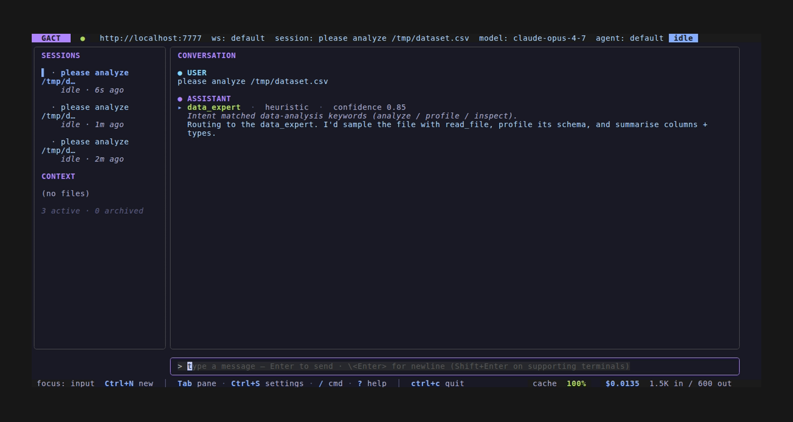
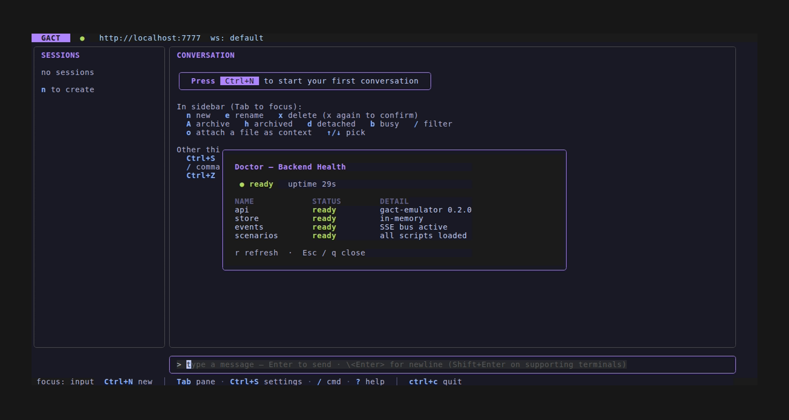

# GACT v0.2 — what's new

> Released on the [`clio`](https://github.com/JaimeCernuda/gact-tui/tree/clio) branch. Full spec: [`contract/SPEC.md`](../contract/SPEC.md).

v0.2 is an **additive** bump to GACT: every v0.1 client keeps working unchanged against a v0.2 backend, and a v0.2 client gracefully degrades against a v0.1 backend by reading new fields as absent + new capability flags as `false`. No breaking changes — v0.1 backends advertise `contract_version: "0.1"` and skip the new endpoints; v0.2 clients gate the new UI on the capabilities they actually see.

The driving need: build a contract that natively expresses the semantics of a modern multi-tier agentic-coder backend (CLIO is the reference implementation), without losing the simpler vendors that already conform to v0.1.

## At-a-glance

| Capability flag | What it advertises | Section |
|---|---|---|
| `agent_routing` | Multi-tier agent hierarchy + per-turn routing decisions | [§4.3.1](../contract/SPEC.md) |
| `memory` | `/v1/memory/stats` introspection | [§6.19](../contract/SPEC.md) |
| `structured_errors` | Typed error envelope with taxonomy | [§14](../contract/SPEC.md) |
| `integration_health` | Per-subsystem health rows on `/v1/health` | [§3.4](../contract/SPEC.md) |
| `tool_telemetry` | `cached` + `duration_ms` on `tool_result` parts | [§4.5](../contract/SPEC.md) |

A backend that supports none of these reports the new flags `false` and runs as a v0.1 backend with a `contract_version: "0.2"` label — the TUI then disables every new affordance.

## What landed

### 1. Multi-tier agent routing (`agent_routing`)

Modern backends route user queries through a tier-1 orchestrator that picks one of N tier-2 specialist agents (mixture-of-experts pattern). v0.1 modeled agents flatly; v0.2 adds an optional `tier` dimension to the existing `AgentDef` shape, plus `specialization` (a UI palette hint) and `keywords` (the intent tokens the orchestrator matches).

```json
// GET /v1/agents?tier=2
{
  "agents": [
    {
      "id": "code_expert",
      "tier": 2,
      "specialization": "code_editing",
      "keywords": ["edit", "refactor", "fix", "review"],
      "tools": ["read_file", "edit_file", "grep"],
      "title": "Code Expert",
      "description": "Source-level editing, review, refactoring",
      "source": "builtin"
    },
    ...
  ]
}
```

A new part type `routing_decision` is emitted as the FIRST part of every assistant message when this flag is on:

```json
{
  "type": "routing_decision",
  "selected_agent": "code_expert",
  "rationale": "Intent matched code-editing keywords",
  "confidence": 0.85,
  "heuristic": true
}
```

A new SSE event `session.agent_routed` fires at the same moment — clients can render the badge as soon as the routing decision is known, before the answer text starts streaming.

**TUI rendering:** the badge appears at the top of every assistant turn, palette-coloured by `specialization`:



### 2. Memory introspection (`memory`)

New endpoint `GET /v1/memory/stats[?session_id=]` exposes cache hit/miss counters, per-session context budget, and global ARC totals.

```json
// GET /v1/memory/stats?session_id=sess_abc
{
  "cache":   { "hits": 80, "misses": 20, "hit_rate": 0.80, "capacity": 1000 },
  "session": { "session_id": "sess_abc", "messages_retained": 12, "tokens_retained": 2840, "tokens_budget": 4000, "profiles_attached": 3 },
  "global":  { "conversations_total": 42, "invocations_total": 187 },
  "metadata": {}
}
```

**TUI rendering:** the footer carries a `cache NN%` chip, traffic-lit (≥75% green, ≥50% amber, else red). Refreshes after every turn settles to idle.

### 3. Structured error taxonomy (`structured_errors`)

v0.1 had `error` parts with free-form `code` + `message`. v0.2 adds a typed envelope used in three places: `Message.error_info`, the body of an `error` part, and HTTP 4xx/5xx responses.

```json
{
  "error": "tool_error",
  "message": "Read of /tmp/x.h5 exceeded CLIO_MAX_FILE_SIZE_BYTES",
  "details": { "tool": "hdf5_analyze", "file_policy": "outside_allowed_roots" },
  "recoverable": true,
  "retry_after_s": null
}
```

Canonical taxonomy:

| `error` | Meaning |
|---|---|
| `provider_error` | Upstream LM / model provider failed (timeout, auth, rate-limit) |
| `routing_error` | Tier-1 orchestrator couldn't classify the query |
| `agent_error` | A tier-2 agent's loop failed |
| `tool_error` | Tool invocation returned an error or raised |
| `permission_error` | Backend's file/path/capability policy rejected the request |
| `config_error` | Env / config invalid (missing API key, bad endpoint) |
| `cancelled` | User cancelled |
| `rate_limited` | Soft-limit backoff |
| `internal_error` | Unclassified backend failure |

Backends MAY add vendor-specific types prefixed `x_<vendor>_`. v0.1 + v0.2 shapes both pass conformance during migration.

### 4. Integration health (`integration_health`)

`/v1/health` grew an optional `integrations[]` array + `overall_status`. Lets a single chip in the TUI summarize backend health, and a `/doctor` modal break it down per subsystem.

```json
{
  "healthy": true,
  "uptime_s": 3725,
  "overall_status": "degraded",
  "integrations": [
    {"name": "lm",         "status": "ready",       "detail": "openai/gpt-4o-mini"},
    {"name": "gateway",    "status": "ready",       "detail": "5 tools mounted"},
    {"name": "arc",        "status": "ready",       "detail": "cache 87% hit rate"},
    {"name": "clio_core",  "status": "unavailable", "detail": "iowarp binary not found"}
  ]
}
```

`overall_status` is the worst status across rows (ready if all ready; degraded if any degraded and none unavailable; unavailable if any unavailable). Names are free-form — common ones: `lm`, `gateway`, `arc`, `file_policy`, `api`, `clio_core`. Unknown names render as a generic row.

**TUI rendering:** new `/doctor` slash-command opens a modal showing the table with colour-coded status chips:



### 5. Tool telemetry (`tool_telemetry`)

`tool_result` parts grew two optional fields:

- `cached: bool` — true when the result came from a memory cache hit (no fresh execution)
- `duration_ms: number` — wall-clock including any cache lookup

The TUI uses these to render a per-tool gutter glyph (`⚡` fresh, `✓` cached) and a latency annotation. Useful for observability and for noticing when a turn is unexpectedly slow because the cache is missing.

### 6. New events

| Event | Payload | When |
|---|---|---|
| `session.agent_routed` | `{session_id, message_id, selected_agent, rationale?, confidence?, heuristic}` | Tier-1 picks a tier-2 agent for the current turn |
| `memory.cache.updated` | `{cache: {hits, misses, hit_rate, capacity}, scope, session_id?}` | Backend pushes a stats snapshot (alternative to client polling) |
| `integration.status_changed` | `{integration: {name, status, detail}, prev_status}` | One of `/v1/health`'s rows flipped |

## Reference backends

| Backend | Status | Capabilities advertised |
|---|---|---|
| **gact-emulator** | v0.2 reference | All 5 v0.2 flags + most v0.1 flags. Lives in `emulator/`. |
| **clio-agent-gact** | v0.2, in active development on iowarp/clio-agent's `tui-integration` branch | `agent_routing`, `memory`, `structured_errors`, `integration_health`, `sessions` (others land progressively per the `CLIO-BBBBBBBBBB` plan) |
| claudecode / opencode / crush / goose | v0.1, advertise v0.2 flags as `false` | TUI hides v0.2 affordances when driving these |

## Migration

If you have a v0.1 backend you maintain:

1. Bump `contract_version` to `"0.2"` in your `/v1/capabilities` response. **No other change required.** All v0.2 capability flags default to `false`; the TUI continues to drive your backend with v0.1 semantics.
2. Pick one of the new capabilities to implement. Each is independent. The flag goes from `false` to `true` only when the underlying surface actually works.
3. Existing `error` part shape (v0.1) keeps working. v0.2 clients accept both old and new error envelopes during migration.

If you are a TUI / client speaking v0.2:

1. Read `capabilities.contract_version` + the v0.2 flags. Disable rendering for any flag that's `false`.
2. The new part types (`routing_decision`) only appear when their gating capability is set; ignore them otherwise.
3. The new HTTP error envelope is preferred but the v0.1 `{code, message}` shape is still valid — accept both.

## Conformance

`contract/conformance/` got 5 new suites — one per v0.2 capability. Run them against your backend:

```sh
cd contract/conformance
go test -v -run 'V0_2_'
```

Each suite is gated on the corresponding capability flag, so a v0.1 backend reports them all as skipped (no failures).

## What's pinned for v0.3

Tracked in [iowarp/clio-agent issues](https://github.com/iowarp/clio-agent/issues) (because they emerged from CLIO's own roadmap, not from a TUI ask):

- Per-tool SSE telemetry events (`tool.call.started` / `tool.call.completed` with cached + duration_ms)
- Real token streaming on the SSE channel
- Cooperative cancellation
- Two-phase edit workflow + permission gating
- Session forks + message search

Each lands as it lands. v0.3 won't bump until the additions are coherent enough to declare a version cut.

## Where to go from here

- Spec: [`contract/SPEC.md`](../contract/SPEC.md)
- TUI behaviour: [`docs/FEATURES.md`](FEATURES.md)
- CLIO integration plan: [`docs/archive/PLAN.md`](archive/PLAN.md) phase `CLIO-BBBBBBBBBB`
- CLIO-side surface: [iowarp/clio-agent docs/tui/](https://github.com/iowarp/clio-agent/tree/tui-integration/docs/tui)
