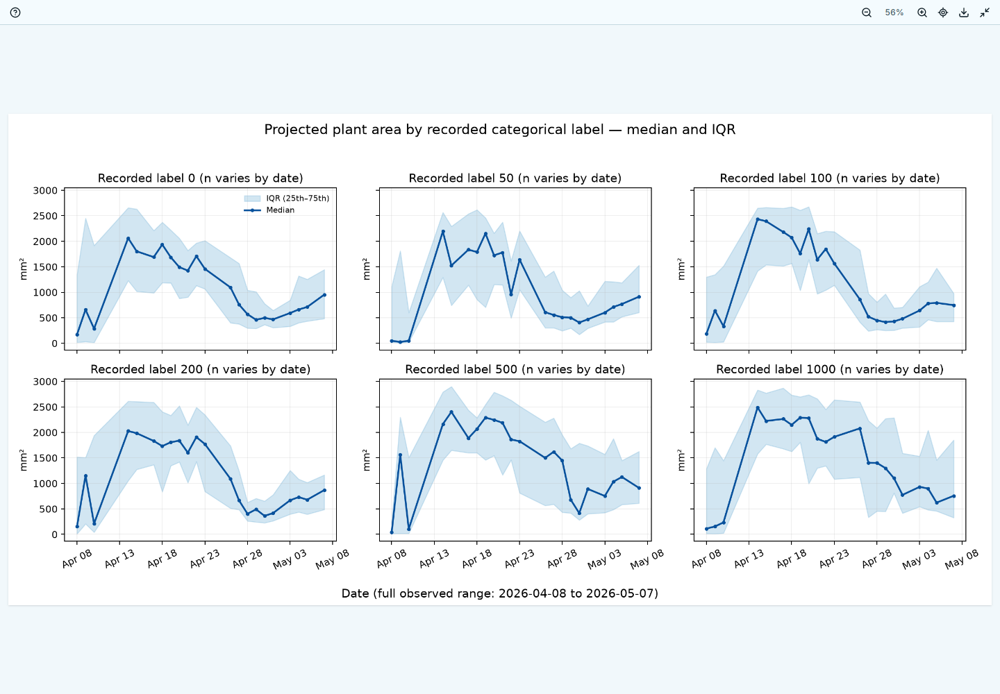
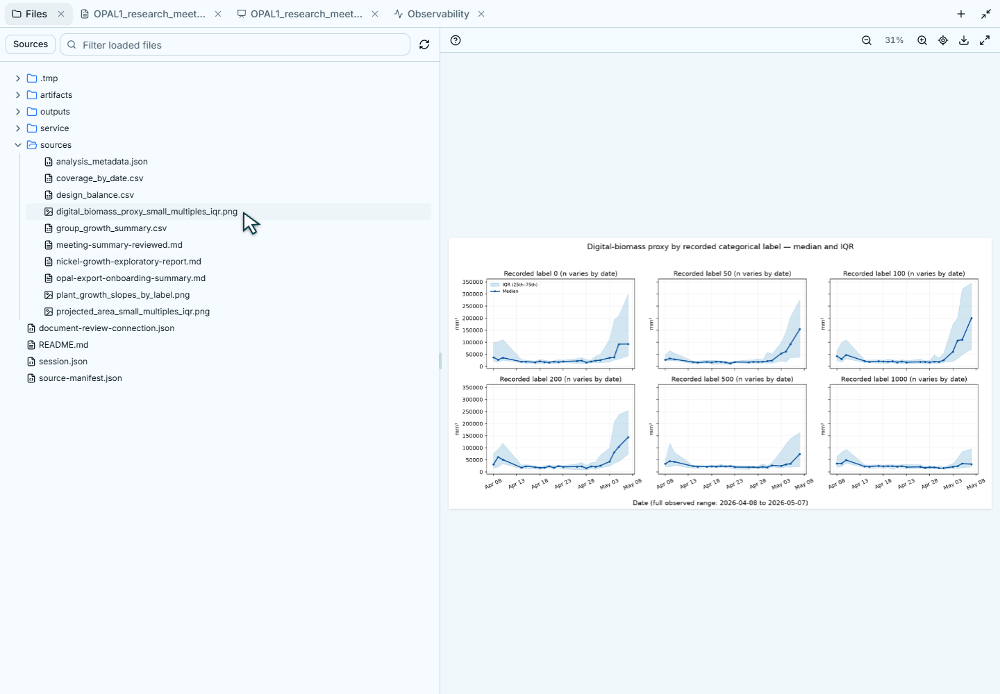
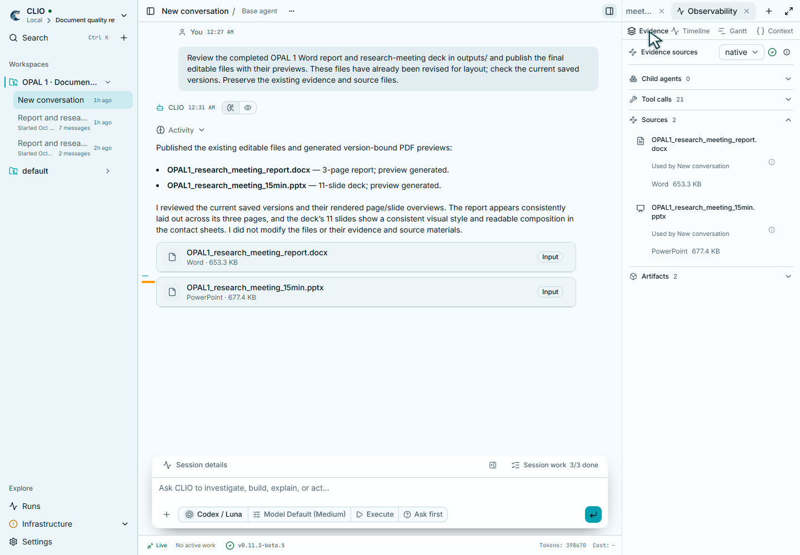
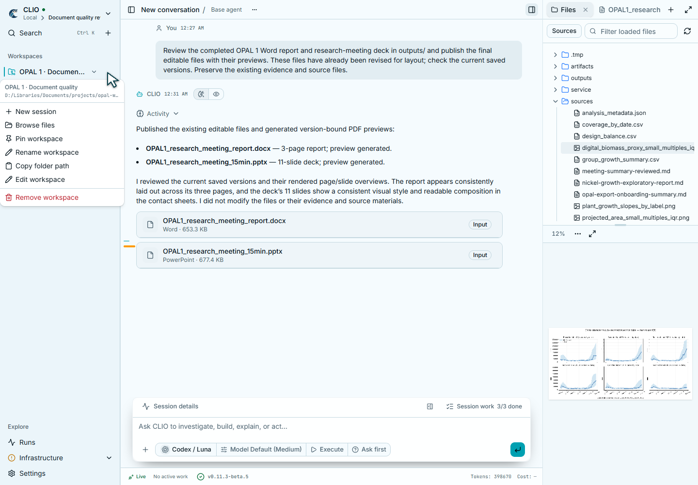

# Workspace presentation

The conversation and canvas share 40px headers. In Desktop, workspace navigation
and actions occupy the native title bar, leaving the conversation directly below
it. Browser routes keep their own header. Controls retain their route and sidebar
context when placed in the title bar, and fall back to the route header when no
native host is available.

Artifact viewers share one 36px toolbar. Preview, Versions, and Lineage remain
direct tabs. A document's format, revision, and complete content hash are in
Document information; reading, raw Markdown, reviews, and safety use the same
toolbar. Images keep zoom, fit, download, and fullscreen beside those tabs.
At pane widths below 480px, secondary controls use labelled menus. The breakpoint
follows the viewer width rather than the application window, so narrow split panes
remain usable on large displays. Document menus mark the current view.

Icon buttons have accessible names and hover/focus tooltips. Supporting text uses
12px type; activity headings and action rows use 13px; conversation titles use
14px. Output cards use readable format names and retain exact MIME types on hover.

Activity disclosure arrows sit beside their labels. Adjacent recorded Markdown
headings have visible separators in the summary. Expanding a step retains its
original thinking text, tool input, output, timing, status, and routed interactions.
Collapsed details occupy no empty vertical space. These are rendering changes;
provider records and tool semantics remain intact.

`workspace-presentation.spec.ts` checks header alignment, narrow-pane overflow,
keyboard-focus labels, zoom, image download, version history, lineage, and toolbar
accessibility. Office preview checks exercise Word, PowerPoint, and Excel. The
desktop-dark and mobile-light visual baselines cover the shared layout.

## Directory browsing and workspace density

The sidebar uses flat 32px workspace and conversation rows. Its default width is
248px and remains resizable. Workspace and conversation menus appear on hover or
keyboard focus; the connection picker, search, create/import, and navigation
actions keep their existing behavior.

The Files view requests the immediate children of the root and of expanded
folders. Each directory has its own 200-entry page and a **Load more files**
action. Closed folders do not make directory requests or consume another
folder's page. Opening a directory does not read the bodies of its files.
Approved connected sources, uploads, linked folders, hidden-file preferences,
and private cache restrictions still apply. Older servers retain the recursive
listing fallback. The filter is labelled **Filter loaded files** because it
filters the directories already loaded, rather than claiming a workspace search.

Images fit after every decode, including a replacement with the same aspect
ratio that does not trigger a viewport resize. Fit, original-size zoom, download,
and fullscreen share the existing image toolbar. Maximizing or restoring the
canvas retains the selected tab; a previously handled open request is not
replayed when the canvas enters its portal.

Observability uses a compact row of Evidence, Timeline, Gantt, and Context tabs.
The Evidence header keeps provider selection and a labelled information button.
The information popover exposes the exact provider/source/status and artifact
provider; incomplete-provenance reasons remain visible. Empty child-agent
inventories start collapsed. Used artifacts show their actual file name, format,
and size, open the corresponding artifact, and retain the source identifier in
their details popover. Authored provenance labels are preserved.

## Rendered review, October 6, 2026

These are real browser captures from an isolated CLIO workspace containing the
OPAL report, deck, and original analysis plots. The source files were unchanged.
The review exercised narrow and maximized panes, same-ratio image replacement,
fullscreen, 100% zoom, fit, folder expansion, and sidebar menus. Evidence,
Timeline, Gantt, and Context were opened and inspected. Gantt remains a scrollable
timeline in a narrow pane.

Focused regression checks cover directory paging and expansion, the root request
and hidden-file options, image replacement, legacy artifact recovery, evidence
details and source navigation, and canvas maximize/restore. They run individually
with one worker locally. Broad regression and visual-baseline checks run in CI.
Lint, online/offline builds, and a Windows debug Desktop build passed.

Native Desktop visual acceptance is pending: automatic approval review rejected
launching the isolated review build with “blocked by policy.” The built app uses a
separate review identity and private service; it does not replace the installed
Desktop. Shared browser rendering and a successful native build do not substitute
for inspecting the native title bar, controls, and their interaction.
